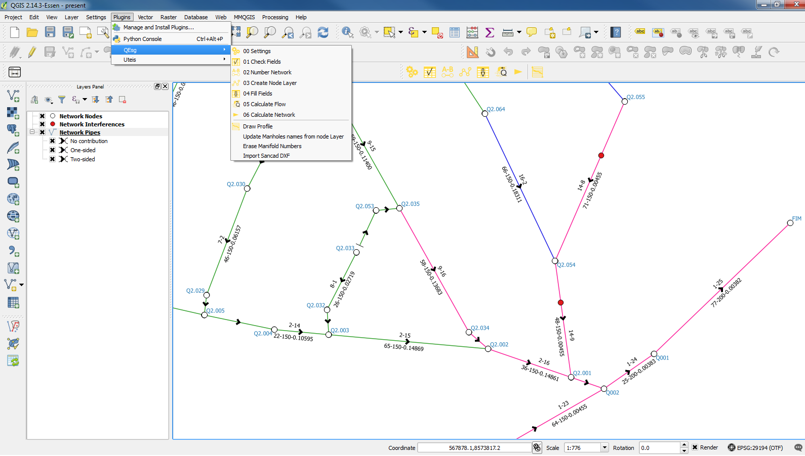
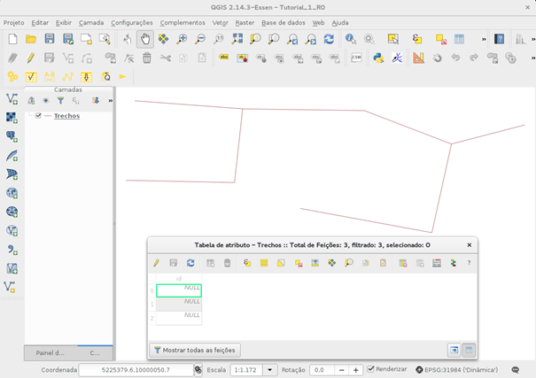
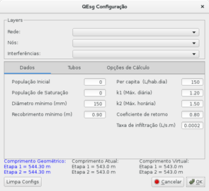
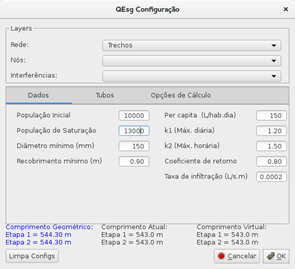
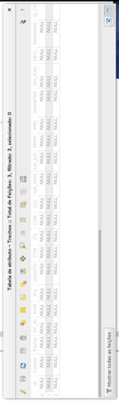
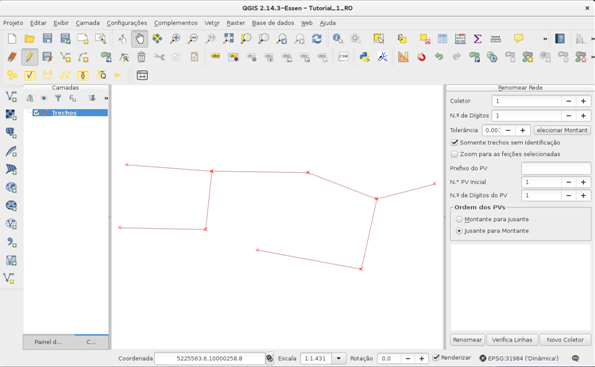

<html xmlns:v="urn:schemas-microsoft-com:vml"
xmlns:o="urn:schemas-microsoft-com:office:office"
xmlns:w="urn:schemas-microsoft-com:office:word"
xmlns:m="http://schemas.microsoft.com/office/2004/12/omml"
xmlns="http://www.w3.org/TR/REC-html40">

<head>
<meta http-equiv=Content-Type content="text/html; charset=windows-1252">
<meta name=ProgId content=Word.Document>
<meta name=Generator content="Microsoft Word 12">
<meta name=Originator content="Microsoft Word 12">
<link rel=File-List href="Tutorial_arquivos/filelist.xml">
<link rel=Edit-Time-Data href="Tutorial_arquivos/editdata.mso">

</head>

 
 

<body lang=PT-BR style='tab-interval:36.0pt'>

<![if !supportLists]>1&nbsp;&nbsp;&nbsp;&nbsp;&nbsp;&nbsp;&nbsp;&nbsp;&nbsp;&nbsp;&nbsp;&nbsp;&nbsp;&nbsp;&nbsp;&nbsp;&nbsp;&nbsp;&nbsp;&nbsp;
<b>CONCEITUAÇÃO</b>

<o:p>&nbsp;</o:p>

A estrutura da rede atende aos seguintes princípios.

<![if !supportLists]>•&nbsp;&nbsp;&nbsp;&nbsp;&nbsp;&nbsp;&nbsp;&nbsp;
<![endif]>O plugin considera a rede formada por um ou mais
coletores.

<![if !supportLists]>•&nbsp;&nbsp;&nbsp;&nbsp;&nbsp;&nbsp;&nbsp;&nbsp;
<![endif]>O coletor principal possui o PV final da rede.

<![if !supportLists]>•&nbsp;&nbsp;&nbsp;&nbsp;&nbsp;&nbsp;&nbsp;&nbsp;
<![endif]>Os coletores são divididos em um ou mais
trechos.

<o:p>&nbsp;</o:p>

Outros detalhes básicos são apresentados no exemplo de
aplicação a seguir.

Os exemplos comentados nesse tutorial estão disponíveis na pasta 'sample' do próprio plugin.

<o:p>&nbsp;</o:p>

<![if !supportLists]>2&nbsp;&nbsp;&nbsp;&nbsp;&nbsp;&nbsp;&nbsp;&nbsp;&nbsp;&nbsp;&nbsp;&nbsp;&nbsp;&nbsp;&nbsp;&nbsp;&nbsp;&nbsp;&nbsp;&nbsp;
<![endif]><b>EXEMPLO DE APLICAÇÃO</b>

<o:p>&nbsp;</o:p>

<![if !supportLists]>•&nbsp;&nbsp;&nbsp;&nbsp;&nbsp;&nbsp;&nbsp;&nbsp;
<![endif]>Configure o projeto para as coordenadas UTM,
conforme a faixa meridiana local.

<![if !supportLists]>•&nbsp;&nbsp;&nbsp;&nbsp;&nbsp;&nbsp;&nbsp;&nbsp;
<![endif]>Carregue um arquivo vetorial (shape) com a rede
de esgoto. Como alternativa você pode criar um arquivo de linhas no formato
shape e desenhar a rede de esgoto utilizando os recursos do QGIS, neste caso
siga estritamente as recomendações seguintes para a criação de arquivo:

<![if !supportLists]>&#9702;&nbsp;&nbsp;&nbsp;&nbsp;&nbsp;&nbsp;&nbsp;
<![endif]>Salve o arquivo (ex.: <b>Trechos)</b> utilizando
um Sistema de Referência de Coordenadas (CRS) em Projeção UTM, para a faixa
meridiana local.

<![if !supportLists]>&#9702;&nbsp;&nbsp;&nbsp;&nbsp;&nbsp;&nbsp;&nbsp;
<![endif]>Desenhe sempre os trechos na direção do fluxo
(de montante para jusante).

<![if !supportLists]>&#9702;&nbsp;&nbsp;&nbsp;&nbsp;&nbsp;&nbsp;&nbsp;
<![endif]>Não é necessário criar nenhum campo específico
no momento de salvar o shape <b>Trechos</b>.

<![if !supportLists]>•&nbsp;&nbsp;&nbsp;&nbsp;&nbsp;&nbsp;&nbsp;&nbsp;
<![endif]>Salve o projeto. Nesse momento a janela do
projeto terá a aparência da <b>Figura 1</b>.

<![if !supportLists]>•&nbsp;&nbsp;&nbsp;&nbsp;&nbsp;&nbsp;&nbsp;&nbsp;
<![endif]>Abra a tabela de atributos do shape de rede,
onde existirá uma linha para cada coletor traçado e somente um campo com
valores nulos (vide <b>Figura 1</b>).

<o:p>&nbsp;</o:p>

<!--[if gte vml 1]><v:shapetype id="_x0000_t75"
 coordsize="21600,21600" o:spt="75" o:preferrelative="t" path="m@4@5l@4@11@9@11@9@5xe"
 filled="f" stroked="f">
 <v:stroke joinstyle="miter"/>
 <v:formulas>
  <v:f eqn="if lineDrawn pixelLineWidth 0"/>
  <v:f eqn="sum @0 1 0"/>
  <v:f eqn="sum 0 0 @1"/>
  <v:f eqn="prod @2 1 2"/>
  <v:f eqn="prod @3 21600 pixelWidth"/>
  <v:f eqn="prod @3 21600 pixelHeight"/>
  <v:f eqn="sum @0 0 1"/>
  <v:f eqn="prod @6 1 2"/>
  <v:f eqn="prod @7 21600 pixelWidth"/>
  <v:f eqn="sum @8 21600 0"/>
  <v:f eqn="prod @7 21600 pixelHeight"/>
  <v:f eqn="sum @10 21600 0"/>
 </v:formulas>
 <v:path o:extrusionok="f" gradientshapeok="t" o:connecttype="rect"/>
 <o:lock v:ext="edit" aspectratio="t"/>
</v:shapetype><v:shape id="Figura2" o:spid="_x0000_i1036" type="#_x0000_t75"
 style='width:453.75pt;height:320.25pt;visibility:visible;mso-wrap-style:square'>
 <v:imagedata src="Tutorial_arquivos/image001.png" o:title=""/>
</v:shape><![endif]--><![if !vml]><![endif]>

Figura 1 - Aparência inicial do projeto, após carregar ou traçar a rede de esgotos.

<o:p>&nbsp;</o:p>

<o:p>&nbsp;</o:p>

<![if !supportLists]>3&nbsp;&nbsp;&nbsp;&nbsp;&nbsp;&nbsp;&nbsp;&nbsp;&nbsp;&nbsp;&nbsp;&nbsp;&nbsp;&nbsp;&nbsp;&nbsp;&nbsp;&nbsp;&nbsp;&nbsp;
<![endif]><!--[if gte vml 1]><v:shape id="Figura9"
 o:spid="_x0000_i1035" type="#_x0000_t75" style='width:22.5pt;height:22.5pt;
 visibility:visible;mso-wrap-style:square'>
 <v:imagedata src="Tutorial_arquivos/image003.png" o:title=""/>
</v:shape><![endif]--><![if !vml]><![endif]><b>BOTÃO
00 CONFIGURAÇÃO</b>

<o:p>&nbsp;</o:p>

Ao clicar abre uma janela apresentada na <b>Figura 2</b>.

<o:p>&nbsp;</o:p>

<table class=MsoNormalTable border=0 cellspacing=0 cellpadding=0 width=605
 style='margin-left:2.25pt;border-collapse:collapse;mso-table-layout-alt:fixed;
 mso-padding-alt:0cm .5pt 0cm .5pt'>
 <tr style='mso-yfti-irow:0;mso-yfti-firstrow:yes;mso-yfti-lastrow:yes'>
  <td width=302 valign=top style='width:8.0cm;border:solid black 1.0pt;
  border-right:none;mso-border-top-alt:solid black .25pt;mso-border-left-alt:
  solid black .25pt;mso-border-bottom-alt:solid black .25pt;padding:2.75pt 2.75pt 2.75pt 2.75pt'>
  
<!--[if gte vml 1]><v:shape id="Figura3" o:spid="_x0000_s1027"
   type="#_x0000_t75" style='position:absolute;left:0;text-align:left;
   margin-left:0;margin-top:0;width:221.3pt;height:201.4pt;z-index:1;
   visibility:visible;mso-wrap-style:square;mso-wrap-distance-left:9pt;
   mso-wrap-distance-top:0;mso-wrap-distance-right:9pt;
   mso-wrap-distance-bottom:0;mso-position-horizontal:center;
   mso-position-horizontal-relative:text;mso-position-vertical:top;
   mso-position-vertical-relative:text'>
   <v:imagedata src="Tutorial_arquivos/image005.png" o:title=""/>
   <w:wrap type="square"/>
  </v:shape><![endif]--><![if !vml]><![endif]>Figura
  2 - Janela do Botão 00 - Configuração

  </td>
  <td width=302 valign=top style='width:8.0cm;border:solid black 1.0pt;
  mso-border-alt:solid black .25pt;padding:2.75pt 2.75pt 2.75pt 2.75pt'>
  
<!--[if gte vml 1]><v:shape id="Figura4" o:spid="_x0000_s1026"
   type="#_x0000_t75" style='position:absolute;left:0;text-align:left;
   margin-left:0;margin-top:0;width:221.3pt;height:201.4pt;z-index:2;
   visibility:visible;mso-wrap-style:square;mso-wrap-distance-left:9pt;
   mso-wrap-distance-top:0;mso-wrap-distance-right:9pt;
   mso-wrap-distance-bottom:0;mso-position-horizontal:center;
   mso-position-horizontal-relative:text;mso-position-vertical:top;
   mso-position-vertical-relative:text'>
   <v:imagedata src="Tutorial_arquivos/image007.png" o:title=""/>
   <w:wrap type="square"/>
  </v:shape><![endif]--><![if !vml]><![endif]>Figura
  3 - Janela do Botão 00 – Configuração após preenchimento dos dados básicos

  </td>
 </tr>
</table>

<o:p>&nbsp;</o:p>

Preencher as informações básicas na janela aberta.

<![if !supportLists]>•&nbsp;&nbsp;&nbsp;&nbsp;&nbsp;&nbsp;&nbsp;&nbsp;
<![endif]>No grupo Layers selecione o arquivo de linhas
que você salvou com o nome <b>Trechos</b>, com o traçado da rede.  

<![if !supportLists]>•&nbsp;&nbsp;&nbsp;&nbsp;&nbsp;&nbsp;&nbsp;&nbsp;
<![endif]>Neste exemplo, somente incluiremos dois
parâmetros de entrada da aba <b>Dados</b> (atenção: não digite separador de
milhar, o ponto é separador de decimais):

<![if !supportLists]>&#9702;&nbsp;&nbsp;&nbsp;&nbsp;&nbsp;&nbsp;&nbsp;
<![endif]>População inicial: (digite) 10000

<![if !supportLists]>&#9702;&nbsp;&nbsp;&nbsp;&nbsp;&nbsp;&nbsp;&nbsp;
<![endif]>População de saturação: (digite) 13000

<![if !supportLists]>•&nbsp;&nbsp;&nbsp;&nbsp;&nbsp;&nbsp;&nbsp;&nbsp;
<![endif]>Mantenha os parâmetros padrões das abas <b>Tubos</b>
e <b>Opções de cálculo</b>. A janela terá a aparência da <b>Figura 3</b>.

<![if !supportLists]>•&nbsp;&nbsp;&nbsp;&nbsp;&nbsp;&nbsp;&nbsp;&nbsp;
<![endif]>Clique no botão <b>OK</b> para salvar os
parâmetros gerais do projeto.

<o:p>&nbsp;</o:p>

<o:p>&nbsp;</o:p>

<![if !supportLists]>4&nbsp;&nbsp;&nbsp;&nbsp;&nbsp;&nbsp;&nbsp;&nbsp;&nbsp;&nbsp;&nbsp;&nbsp;&nbsp;&nbsp;&nbsp;&nbsp;&nbsp;&nbsp;&nbsp;&nbsp;
<![endif]><!--[if gte vml 1]><v:shape id="Figura10"
 o:spid="_x0000_i1034" type="#_x0000_t75" style='width:22.5pt;height:22.5pt;
 visibility:visible;mso-wrap-style:square'>
 <v:imagedata src="Tutorial_arquivos/image009.png" o:title=""/>
</v:shape><![endif]--><![if !vml]><![endif]><b>BOTÃO 01 VERIFICA/CRIA CAMPOS</b>

<o:p>&nbsp;</o:p>

Ao pressionar neste botão o plugin verifica se o shape <b>Trechos</b>
com o traçado da rede contém os campos padrões. Se não existe oferece a
possibilidade de criá-los automaticamente, como mostra a <b>Figura 4</b>.
Aceite essa opção.

<o:p>&nbsp;</o:p>

Abra novamente a tabela de atributos do shape <b>Trechos</b>
com a rede de esgoto (vide <b>Figura 5</b>). Você verá que foram criados um
conjunto de campos para cada coletor traçado. Os valores contidos nesses campos
serão nulos ou zeros (sem informação ainda).

<o:p>&nbsp;</o:p>

<table class=MsoNormalTable border=0 cellspacing=0 cellpadding=0 width=605
 style='margin-left:2.25pt;border-collapse:collapse;mso-table-layout-alt:fixed;
 mso-padding-alt:0cm .5pt 0cm .5pt'>
 <tr style='mso-yfti-irow:0;mso-yfti-firstrow:yes;mso-yfti-lastrow:yes'>
  <td width=302 valign=top style='width:8.0cm;border:solid black 1.0pt;
  border-right:none;mso-border-top-alt:solid black .25pt;mso-border-left-alt:
  solid black .25pt;mso-border-bottom-alt:solid black .25pt;padding:2.75pt 2.75pt 2.75pt 2.75pt'>
  
<!--[if gte vml 1]><v:shape
   id="Figura5" o:spid="_x0000_i1033" type="#_x0000_t75" style='width:141.75pt;
   height:340.5pt;visibility:visible;mso-wrap-style:square'>
   <v:imagedata src="Tutorial_arquivos/image011.png" o:title=""/>
  </v:shape><![endif]--><![if !vml]><![endif]>

  
Figura 4 - Mensagem para criação dos campos padrões no
  shape da rede de esgotos.

  </td>
  <td width=302 valign=top style='width:8.0cm;border:solid black 1.0pt;
  mso-border-alt:solid black .25pt;padding:2.75pt 2.75pt 2.75pt 2.75pt'>
  
<!--[if gte vml 1]><v:shape
   id="Figura6" o:spid="_x0000_i1032" type="#_x0000_t75" style='width:100.5pt;
   height:339.75pt;visibility:visible;mso-wrap-style:square'>
   <v:imagedata src="Tutorial_arquivos/image013.png" o:title=""/>
  </v:shape><![endif]--><![if !vml]><![endif]>

  
Figura 5 - Tabela da rede de esgotos, após a criação
  dos campos padrões.

  </td>
 </tr>
</table>

<o:p>&nbsp;</o:p>

<o:p>&nbsp;</o:p>

<![if !supportLists]>5&nbsp;&nbsp;&nbsp;&nbsp;&nbsp;&nbsp;&nbsp;&nbsp;&nbsp;&nbsp;&nbsp;&nbsp;&nbsp;&nbsp;&nbsp;&nbsp;&nbsp;&nbsp;&nbsp;&nbsp;
<![endif]><!--[if gte vml 1]><v:shape id="Figura11"
 o:spid="_x0000_i1031" type="#_x0000_t75" style='width:22.5pt;height:22.5pt;
 visibility:visible;mso-wrap-style:square'>
 <v:imagedata src="Tutorial_arquivos/image015.png" o:title=""/>
</v:shape><![endif]--><![if !vml]><![endif]><b>BOTÃO
02 NUMERAR REDE</b>

<o:p>&nbsp;</o:p>

Ao clicar nesse botão é verificado se o traçado da rede de
esgoto é composto por segmentos simples (segmentos de reta individuais entre
vértices consecutivos). Caso exista algum elemento de rede com mais de dois
vértices, será apresentada uma mensagem semelhante à da <b>Figura 6</b>.

<o:p>&nbsp;</o:p>

<!--[if gte vml 1]><v:shape
 id="Figura7" o:spid="_x0000_i1030" type="#_x0000_t75" style='width:219.75pt;
 height:57pt;visibility:visible;mso-wrap-style:square'>
 <v:imagedata src="Tutorial_arquivos/image017.png" o:title=""/>
</v:shape><![endif]--><![if !vml]><![endif]>

Figura 6 -
Mensagem subdivisão de coletores em trechos.

<o:p>&nbsp;</o:p>

No nosso exemplo, antes de clicar pela primeira vez, o shape <b>Trechos</b>
possui três coletores traçados de montante para jusante (vide <b>Figura 5</b>)
definidos por poligonais abertas (um coletor com 5 vértices e dois coletores
com 3). Na mensagem semelhante à da <b>Figura 6</b> clicar em <b>Sim</b>.

<![if !supportLists]>•&nbsp;&nbsp;&nbsp;&nbsp;&nbsp;&nbsp;&nbsp;&nbsp;
<![endif]><u>Mensagem para subdivisão de coletores em
trechos</u>. Existem elementos com ( …). Deseja convertê-los para linhas
simples? (vide ) <b>Figura 6</b>. Clique no botão Sim.

<o:p>&nbsp;</o:p>

<!--[if gte vml 1]><v:shape id="Figura8" o:spid="_x0000_i1029"
 type="#_x0000_t75" style='width:446.25pt;height:275.25pt;visibility:visible;
 mso-wrap-style:square'>
 <v:imagedata src="Tutorial_arquivos/image019.png" o:title="" croptop="604f"
  cropbottom="718f" cropleft="519f" cropright="506f"/>
</v:shape><![endif]--><![if !vml]><![endif]>

Figura 7 - Mensagem subdivisão de coletores em trechos.

<o:p>&nbsp;</o:p>

Será aberta uma janela, semelhante à <b>Figura 7</b>, a qual
será fixada na lateral direita no ambiente QGIS. Nos passos a seguir, proceda
com atenção.

<![if !supportLists]>•&nbsp;&nbsp;&nbsp;&nbsp;&nbsp;&nbsp;&nbsp;&nbsp;
<![endif]>Verifique que a caixa &lt;Coletor&gt; esteja
preenchido com o valor 1. Senão digite o valor 1.

<![if !supportLists]>•&nbsp;&nbsp;&nbsp;&nbsp;&nbsp;&nbsp;&nbsp;&nbsp;
<![endif]>Verifique que a caixa &lt;Número de dígitos&gt;
esteja preenchido com o valor 1. Senão digite o valor 1.

<![if !supportLists]>•&nbsp;&nbsp;&nbsp;&nbsp;&nbsp;&nbsp;&nbsp;&nbsp;
<![endif]>Verifique que a opção &lt;Somente trechos sem
identificação&gt; esteja selecionada.

<![if !supportLists]>•&nbsp;&nbsp;&nbsp;&nbsp;&nbsp;&nbsp;&nbsp;&nbsp;
<![endif]>Clique no botão &lt;Selecionar Montante&gt;.

<![if !supportLists]>•&nbsp;&nbsp;&nbsp;&nbsp;&nbsp;&nbsp;&nbsp;&nbsp;
<![endif]>Movimente o cursor e faça clique com o botão
esquerdo (primário) no meio do trecho mais a montante do coletor principal da
rede. Todos os trechos do coletor mudarão para a cor amarela (padrão de seleção
do QGIS)

<![if !supportLists]>•&nbsp;&nbsp;&nbsp;&nbsp;&nbsp;&nbsp;&nbsp;&nbsp;
<![endif]>Clique no botão &lt;Renomear&gt; da janela
Renomear Rede. Na primeira vez, o estilo do shape <b>Trechos</b> é alterado,
são representados os vértices e o sentido do fluxo. Para o coletor renomeado
serão apresentadas as informações: nome do coletor-trecho e nomes dos PVs de
montante e jusante.

<![if !supportLists]>•&nbsp;&nbsp;&nbsp;&nbsp;&nbsp;&nbsp;&nbsp;&nbsp;
<![endif]>Clique no botão &lt;Novo Coletor&gt;. O número
da caixa Coletor mudará para 2 e o trecho anterior será deselecionado.

<![if !supportLists]>•&nbsp;&nbsp;&nbsp;&nbsp;&nbsp;&nbsp;&nbsp;&nbsp;
<![endif]>Verifique que a opção &lt;Somente trechos sem
identificação&gt; continue selecionada.

<![if !supportLists]>•&nbsp;&nbsp;&nbsp;&nbsp;&nbsp;&nbsp;&nbsp;&nbsp;
<![endif]>Selecione o segundo coletor (no nosso exemplo, o
coletor mais a jusante), cuja cor mudará para amarelo até o PV de interligação
com o coletor anterior.

<![if !supportLists]>•&nbsp;&nbsp;&nbsp;&nbsp;&nbsp;&nbsp;&nbsp;&nbsp;
<![endif]>Clique em renomear o coletor selecionado. O
coletor selecionado será renomeado e numerado, de forma análoga ao primeiro
coletor.

<![if !supportLists]>•&nbsp;&nbsp;&nbsp;&nbsp;&nbsp;&nbsp;&nbsp;&nbsp;
<![endif]>Repita o processo (Novo coletor, clicar sobre o
coletor, renomear) até concluir com a nomeação dos trechos da rede.

<![if !supportLists]>•&nbsp;&nbsp;&nbsp;&nbsp;&nbsp;&nbsp;&nbsp;&nbsp;
<![endif]>Salve o shape <b>Trechos</b> e encerre o
processo de edição.

<o:p>&nbsp;</o:p>

No shape <b>Trechos</b> foram preenchidos os campos Coletor,
Trecho, DC_ID, PVM e PVJ.

<o:p>&nbsp;</o:p>

<o:p>&nbsp;</o:p>

<![if !supportLists]>6&nbsp;&nbsp;&nbsp;&nbsp;&nbsp;&nbsp;&nbsp;&nbsp;&nbsp;&nbsp;&nbsp;&nbsp;&nbsp;&nbsp;&nbsp;&nbsp;&nbsp;&nbsp;&nbsp;&nbsp;
<![endif]><!--[if gte vml 1]><v:shape id="Figura12"
 o:spid="_x0000_i1028" type="#_x0000_t75" style='width:22.5pt;height:22.5pt;
 visibility:visible;mso-wrap-style:square'>
 <v:imagedata src="Tutorial_arquivos/image021.png" o:title=""/>
</v:shape><![endif]--><![if !vml]><![endif]><b>BOTÃO
03 CRIAR LAYER DE NÓS</b>

<o:p>&nbsp;</o:p>

<![if !supportLists]>•&nbsp;&nbsp;&nbsp;&nbsp;&nbsp;&nbsp;&nbsp;&nbsp;
<![endif]>Ao clicar no botão é aberta a janela para
atribuição do nome do shape de nós (formato de pontos). Selecione o local e
nomes adequados a este layer, para este exemplo escolha como nome <b>Nos</b>.
Clique no botão Salvar para concluir a gravação do layer. <u>Atenção</u>:
quando elaborávamos este tutorial, no ambiente Linux, a biblioteca utilizada
para salvar o shape de <b>Nos</b> apresentava um bug. Era necessário digitar a
extensão “.shp” ao final do nome do arquivo para que ocorresse o carregamento
automático do arquivo salvo.

<![if !supportLists]>•&nbsp;&nbsp;&nbsp;&nbsp;&nbsp;&nbsp;&nbsp;&nbsp;
<![endif]>Após fechar a janela o shape <b>Nos</b> é
adicionado ao projeto.

<![if !supportLists]>•&nbsp;&nbsp;&nbsp;&nbsp;&nbsp;&nbsp;&nbsp;&nbsp;
<![endif]>Habilite o modo de edição do shape <b>Nos</b> e
preencha todos os campos de cota do terreno de cada nó.

<![if !supportLists]>•&nbsp;&nbsp;&nbsp;&nbsp;&nbsp;&nbsp;&nbsp;&nbsp;
<![endif]>Salve o shape <b>Nos</b> e desabilite o modo de
edição.

<![if !supportLists]>•&nbsp;&nbsp;&nbsp;&nbsp;&nbsp;&nbsp;&nbsp;&nbsp;
<![endif]>Salve o projeto.

<o:p>&nbsp;</o:p>

<o:p>&nbsp;</o:p>

<![if !supportLists]>7&nbsp;&nbsp;&nbsp;&nbsp;&nbsp;&nbsp;&nbsp;&nbsp;&nbsp;&nbsp;&nbsp;&nbsp;&nbsp;&nbsp;&nbsp;&nbsp;&nbsp;&nbsp;&nbsp;&nbsp;
<![endif]><!--[if gte vml 1]><v:shape id="Figura1"
 o:spid="_x0000_i1027" type="#_x0000_t75" style='width:22.5pt;height:22.5pt;
 visibility:visible;mso-wrap-style:square'>
 <v:imagedata src="Tutorial_arquivos/image023.png" o:title=""/>
</v:shape><![endif]--><![if !vml]><![endif]><b>BOTÃO
04 PREENCHE OS CAMPOS</b>

<o:p>&nbsp;</o:p>

Ao clicar no botão:

<![if !supportLists]>•&nbsp;&nbsp;&nbsp;&nbsp;&nbsp;&nbsp;&nbsp;&nbsp;
<![endif]>Todos os campos nulos do shape <b>Trechos</b>
são preenchidos;

<![if !supportLists]>•&nbsp;&nbsp;&nbsp;&nbsp;&nbsp;&nbsp;&nbsp;&nbsp;
<![endif]>São sobrescritos todos os campos de cota dos PVs
de montante, jusante e comprimento do trecho (calculado como comprimento real
do trecho desenhado) do shape <b>Trechos;</b>

<![if !supportLists]>•&nbsp;&nbsp;&nbsp;&nbsp;&nbsp;&nbsp;&nbsp;&nbsp;
<![endif]>São transferidos os valores do campo COTA_TN do
shape <b>Nos </b>para os campos CTM e CTJ do shape <b>Trechos</b>.

<![if !supportLists]>•&nbsp;&nbsp;&nbsp;&nbsp;&nbsp;&nbsp;&nbsp;&nbsp;
<![endif]>Salve o shape <b>Trechos</b> e saia do modo de
edição.

<o:p>&nbsp;</o:p>

<o:p>&nbsp;</o:p>

<![if !supportLists]>8&nbsp;&nbsp;&nbsp;&nbsp;&nbsp;&nbsp;&nbsp;&nbsp;&nbsp;&nbsp;&nbsp;&nbsp;&nbsp;&nbsp;&nbsp;&nbsp;&nbsp;&nbsp;&nbsp;&nbsp;
<![endif]><b>PONTA SECA</b>

<o:p>&nbsp;</o:p>

Tem como objetivo identificar os trechos que não recebem
contribuições através do PV de montante. Essa identificação é necessária em
trechos cujos PVs de montante possam apresentar mais de uma saída, situação não
permitida segundo as normas brasileiras. A ponta seca é informada manualmente
na tabela do shape <b>Trechos</b>, campo (coluna) PONTA_SECA, trocando a letra
N (não) pela letra S (sim). Após essa alteração a representação de montante dos
trechos “Ponta Seca” será modificada.

<o:p>&nbsp;</o:p>

Salve as modificações introduzidas na tabela do shape <b>Trechos</b>
e saia do modo de edição. Salve o projeto.

<o:p>&nbsp;</o:p>

<o:p>&nbsp;</o:p>

<![if !supportLists]>9&nbsp;&nbsp;&nbsp;&nbsp;&nbsp;&nbsp;&nbsp;&nbsp;&nbsp;&nbsp;&nbsp;&nbsp;&nbsp;&nbsp;&nbsp;&nbsp;&nbsp;&nbsp;&nbsp;&nbsp;
<![endif]><!--[if gte vml 1]><v:shape id="Figura13"
 o:spid="_x0000_i1026" type="#_x0000_t75" style='width:22.5pt;height:22.5pt;
 visibility:visible;mso-wrap-style:square'>
 <v:imagedata src="Tutorial_arquivos/image025.png" o:title=""/>
</v:shape><![endif]--><![if !vml]><![endif]><b>BOTÃO
5 CALCULA VAZÃO</b>

<o:p>&nbsp;</o:p>

Ao clicar neste botão, são calculadas as vazões acumuladas ao
longo de cada um dos trechos que formam os coletores, os resultados são
gravados no shape <b>Trechos</b>. O formato de apresentação dos trechos muda
para mostrar os dados: nome do trecho; comprimento, diâmetro e vazão de cada
trecho.

<o:p>&nbsp;</o:p>

<o:p>&nbsp;</o:p>

<![if !supportLists]>10&nbsp;&nbsp;&nbsp;&nbsp;&nbsp;&nbsp;&nbsp;&nbsp;&nbsp;&nbsp;&nbsp;&nbsp;&nbsp;&nbsp;&nbsp;&nbsp;
<![endif]><!--[if gte vml 1]><v:shape id="Figura14"
 o:spid="_x0000_i1025" type="#_x0000_t75" style='width:22.5pt;height:22.5pt;
 visibility:visible;mso-wrap-style:square'>
 <v:imagedata src="Tutorial_arquivos/image027.png" o:title=""/>
</v:shape><![endif]--><![if !vml]><![endif]><b>BOTÃO
6 DIMENSIONA</b>

<o:p>&nbsp;</o:p>

Ao clicar neste botão, são dimensionados todos os trechos que
formam os coletores da rede. O formato de apresentação dos trechos muda para
mostrar os dados: nome do trecho; comprimento; diâmetro nominal e declividade.

<o:p>&nbsp;</o:p>

Todos os dados do dimensionamento estão contidos na tabela do
shape <b>Trechos</b>. Caso deseje, abra a tabela do shape <b>Trechos</b>,
selecione todos os campos, copie e cole dentro de uma planilha eletrônica
(MS-Excel, Libreoffice-Calc ou outra).

<![if !supportLists]>11&nbsp;&nbsp;&nbsp;&nbsp;&nbsp;&nbsp;&nbsp;&nbsp;&nbsp;&nbsp;&nbsp;&nbsp;&nbsp;&nbsp;&nbsp;&nbsp;
<![endif]><b>ESTRUTURA DAS TABELAS</b>

<o:p>&nbsp;</o:p>

<![if !supportLists]>11.1&nbsp;&nbsp;&nbsp;&nbsp;&nbsp;&nbsp;&nbsp;&nbsp;&nbsp;&nbsp;&nbsp;
<![endif]>SHAPE NÓS

<table class=MsoNormalTable border=0 cellspacing=0 cellpadding=0 width=605
 style='margin-left:2.25pt;border-collapse:collapse;mso-table-layout-alt:fixed;
 mso-padding-alt:0cm .5pt 0cm .5pt'>
 <tr style='mso-yfti-irow:0;mso-yfti-firstrow:yes'>
  <td width=101 valign=top style='width:75.6pt;border:solid black 1.0pt;
  border-right:none;mso-border-top-alt:solid black .25pt;mso-border-left-alt:
  solid black .25pt;mso-border-bottom-alt:solid black .25pt;padding:2.75pt 2.75pt 2.75pt 2.75pt'>
  
<b>Ordem<o:p></o:p></b>

  </td>
  <td width=101 valign=top style='width:75.6pt;border:solid black 1.0pt;
  border-right:none;mso-border-top-alt:solid black .25pt;mso-border-left-alt:
  solid black .25pt;mso-border-bottom-alt:solid black .25pt;padding:2.75pt 2.75pt 2.75pt 2.75pt'>
  
<b>Nome<o:p></o:p></b>

  </td>
  <td width=101 valign=top style='width:75.6pt;border:solid black 1.0pt;
  border-right:none;mso-border-top-alt:solid black .25pt;mso-border-left-alt:
  solid black .25pt;mso-border-bottom-alt:solid black .25pt;padding:2.75pt 2.75pt 2.75pt 2.75pt'>
  
<b>Unidade<o:p></o:p></b>

  </td>
  <td width=101 valign=top style='width:75.6pt;border:solid black 1.0pt;
  border-right:none;mso-border-top-alt:solid black .25pt;mso-border-left-alt:
  solid black .25pt;mso-border-bottom-alt:solid black .25pt;padding:2.75pt 2.75pt 2.75pt 2.75pt'>
  
<b>Tipo<o:p></o:p></b>

  </td>
  <td width=101 valign=top style='width:75.6pt;border:solid black 1.0pt;
  border-right:none;mso-border-top-alt:solid black .25pt;mso-border-left-alt:
  solid black .25pt;mso-border-bottom-alt:solid black .25pt;padding:2.75pt 2.75pt 2.75pt 2.75pt'>
  
<b>Comprimento<o:p></o:p></b>

  </td>
  <td width=101 valign=top style='width:75.6pt;border:solid black 1.0pt;
  mso-border-alt:solid black .25pt;padding:2.75pt 2.75pt 2.75pt 2.75pt'>
  
<b>Precisão<o:p></o:p></b>

  </td>
 </tr>
 <tr style='mso-yfti-irow:1'>
  <td width=101 valign=top style='width:75.6pt;border-top:none;border-left:
  solid black 1.0pt;border-bottom:solid black 1.0pt;border-right:none;
  mso-border-left-alt:solid black .25pt;mso-border-bottom-alt:solid black .25pt;
  padding:2.75pt 2.75pt 2.75pt 2.75pt'>
  
1<o:p></o:p>

  </td>
  <td width=101 valign=top style='width:75.6pt;border-top:none;border-left:
  solid black 1.0pt;border-bottom:solid black 1.0pt;border-right:none;
  mso-border-left-alt:solid black .25pt;mso-border-bottom-alt:solid black .25pt;
  padding:2.75pt 2.75pt 2.75pt 2.75pt'>
  
DC_ID<o:p></o:p>

  </td>
  <td width=101 valign=top style='width:75.6pt;border-top:none;border-left:
  solid black 1.0pt;border-bottom:solid black 1.0pt;border-right:none;
  mso-border-left-alt:solid black .25pt;mso-border-bottom-alt:solid black .25pt;
  padding:2.75pt 2.75pt 2.75pt 2.75pt'>
  
-<o:p></o:p>

  </td>
  <td width=101 valign=top style='width:75.6pt;border-top:none;border-left:
  solid black 1.0pt;border-bottom:solid black 1.0pt;border-right:none;
  mso-border-left-alt:solid black .25pt;mso-border-bottom-alt:solid black .25pt;
  padding:2.75pt 2.75pt 2.75pt 2.75pt'>
  
String<o:p></o:p>

  </td>
  <td width=101 valign=top style='width:75.6pt;border-top:none;border-left:
  solid black 1.0pt;border-bottom:solid black 1.0pt;border-right:none;
  mso-border-left-alt:solid black .25pt;mso-border-bottom-alt:solid black .25pt;
  padding:2.75pt 2.75pt 2.75pt 2.75pt'>
  
10<o:p></o:p>

  </td>
  <td width=101 valign=top style='width:75.6pt;border:solid black 1.0pt;
  border-top:none;mso-border-left-alt:solid black .25pt;mso-border-bottom-alt:
  solid black .25pt;mso-border-right-alt:solid black .25pt;padding:2.75pt 2.75pt 2.75pt 2.75pt'>
  
-<o:p></o:p>

  </td>
 </tr>
 <tr style='mso-yfti-irow:2;mso-yfti-lastrow:yes'>
  <td width=101 valign=top style='width:75.6pt;border-top:none;border-left:
  solid black 1.0pt;border-bottom:solid black 1.0pt;border-right:none;
  mso-border-left-alt:solid black .25pt;mso-border-bottom-alt:solid black .25pt;
  padding:2.75pt 2.75pt 2.75pt 2.75pt'>
  
2<o:p></o:p>

  </td>
  <td width=101 valign=top style='width:75.6pt;border-top:none;border-left:
  solid black 1.0pt;border-bottom:solid black 1.0pt;border-right:none;
  mso-border-left-alt:solid black .25pt;mso-border-bottom-alt:solid black .25pt;
  padding:2.75pt 2.75pt 2.75pt 2.75pt'>
  
COTA_TN<o:p></o:p>

  </td>
  <td width=101 valign=top style='width:75.6pt;border-top:none;border-left:
  solid black 1.0pt;border-bottom:solid black 1.0pt;border-right:none;
  mso-border-left-alt:solid black .25pt;mso-border-bottom-alt:solid black .25pt;
  padding:2.75pt 2.75pt 2.75pt 2.75pt'>
  
m<o:p></o:p>

  </td>
  <td width=101 valign=top style='width:75.6pt;border-top:none;border-left:
  solid black 1.0pt;border-bottom:solid black 1.0pt;border-right:none;
  mso-border-left-alt:solid black .25pt;mso-border-bottom-alt:solid black .25pt;
  padding:2.75pt 2.75pt 2.75pt 2.75pt'>
  
Real<o:p></o:p>

  </td>
  <td width=101 valign=top style='width:75.6pt;border-top:none;border-left:
  solid black 1.0pt;border-bottom:solid black 1.0pt;border-right:none;
  mso-border-left-alt:solid black .25pt;mso-border-bottom-alt:solid black .25pt;
  padding:2.75pt 2.75pt 2.75pt 2.75pt'>
  
10<o:p></o:p>

  </td>
  <td width=101 valign=top style='width:75.6pt;border:solid black 1.0pt;
  border-top:none;mso-border-left-alt:solid black .25pt;mso-border-bottom-alt:
  solid black .25pt;mso-border-right-alt:solid black .25pt;padding:2.75pt 2.75pt 2.75pt 2.75pt'>
  
3<o:p></o:p>

  </td>
 </tr>
</table>

<o:p>&nbsp;</o:p>

<![if !supportLists]>11.2&nbsp;&nbsp;&nbsp;&nbsp;&nbsp;&nbsp;&nbsp;&nbsp;&nbsp;&nbsp;&nbsp;
<![endif]>SHAPE TRECHOS

<table class=MsoNormalTable border=0 cellspacing=0 cellpadding=0 width=605
 style='margin-left:2.25pt;border-collapse:collapse;mso-table-layout-alt:fixed;
 mso-padding-alt:0cm .5pt 0cm .5pt'>
 <tr style='mso-yfti-irow:0;mso-yfti-firstrow:yes'>
  <td width=101 valign=top style='width:75.6pt;border:solid black 1.0pt;
  border-right:none;mso-border-top-alt:solid black .25pt;mso-border-left-alt:
  solid black .25pt;mso-border-bottom-alt:solid black .25pt;padding:2.75pt 2.75pt 2.75pt 2.75pt'>
  
<b>Ordem<o:p></o:p></b>

  </td>
  <td width=101 valign=top style='width:75.6pt;border:solid black 1.0pt;
  border-right:none;mso-border-top-alt:solid black .25pt;mso-border-left-alt:
  solid black .25pt;mso-border-bottom-alt:solid black .25pt;padding:2.75pt 2.75pt 2.75pt 2.75pt'>
  
<b>Nome<o:p></o:p></b>

  </td>
  <td width=101 valign=top style='width:75.6pt;border:solid black 1.0pt;
  border-right:none;mso-border-top-alt:solid black .25pt;mso-border-left-alt:
  solid black .25pt;mso-border-bottom-alt:solid black .25pt;padding:2.75pt 2.75pt 2.75pt 2.75pt'>
  
<b>Unidade<o:p></o:p></b>

  </td>
  <td width=101 valign=top style='width:75.6pt;border:solid black 1.0pt;
  border-right:none;mso-border-top-alt:solid black .25pt;mso-border-left-alt:
  solid black .25pt;mso-border-bottom-alt:solid black .25pt;padding:2.75pt 2.75pt 2.75pt 2.75pt'>
  
<b>Tipo<o:p></o:p></b>

  </td>
  <td width=101 valign=top style='width:75.6pt;border:solid black 1.0pt;
  border-right:none;mso-border-top-alt:solid black .25pt;mso-border-left-alt:
  solid black .25pt;mso-border-bottom-alt:solid black .25pt;padding:2.75pt 2.75pt 2.75pt 2.75pt'>
  
<b>Comprimento<o:p></o:p></b>

  </td>
  <td width=101 valign=top style='width:75.6pt;border:solid black 1.0pt;
  mso-border-alt:solid black .25pt;padding:2.75pt 2.75pt 2.75pt 2.75pt'>
  
<b>Precisão<o:p></o:p></b>

  </td>
 </tr>
 <tr style='mso-yfti-irow:1'>
  <td width=101 valign=top style='width:75.6pt;border-top:none;border-left:
  solid black 1.0pt;border-bottom:solid black 1.0pt;border-right:none;
  mso-border-left-alt:solid black .25pt;mso-border-bottom-alt:solid black .25pt;
  padding:2.75pt 2.75pt 2.75pt 2.75pt'>
  
1<o:p></o:p>

  </td>
  <td width=101 valign=top style='width:75.6pt;border-top:none;border-left:
  solid black 1.0pt;border-bottom:solid black 1.0pt;border-right:none;
  mso-border-left-alt:solid black .25pt;mso-border-bottom-alt:solid black .25pt;
  padding:2.75pt 2.75pt 2.75pt 2.75pt'>
  
DC_ID<o:p></o:p>

  </td>
  <td width=101 valign=top style='width:75.6pt;border-top:none;border-left:
  solid black 1.0pt;border-bottom:solid black 1.0pt;border-right:none;
  mso-border-left-alt:solid black .25pt;mso-border-bottom-alt:solid black .25pt;
  padding:2.75pt 2.75pt 2.75pt 2.75pt'>
  
-<o:p></o:p>

  </td>
  <td width=101 valign=top style='width:75.6pt;border-top:none;border-left:
  solid black 1.0pt;border-bottom:solid black 1.0pt;border-right:none;
  mso-border-left-alt:solid black .25pt;mso-border-bottom-alt:solid black .25pt;
  padding:2.75pt 2.75pt 2.75pt 2.75pt'>
  
QString<o:p></o:p>

  </td>
  <td width=101 valign=top style='width:75.6pt;border-top:none;border-left:
  solid black 1.0pt;border-bottom:solid black 1.0pt;border-right:none;
  mso-border-left-alt:solid black .25pt;mso-border-bottom-alt:solid black .25pt;
  padding:2.75pt 2.75pt 2.75pt 2.75pt'>
  
10<o:p></o:p>

  </td>
  <td width=101 valign=top style='width:75.6pt;border:solid black 1.0pt;
  border-top:none;mso-border-left-alt:solid black .25pt;mso-border-bottom-alt:
  solid black .25pt;mso-border-right-alt:solid black .25pt;padding:2.75pt 2.75pt 2.75pt 2.75pt'>
  
-<o:p></o:p>

  </td>
 </tr>
 <tr style='mso-yfti-irow:2'>
  <td width=101 valign=top style='width:75.6pt;border-top:none;border-left:
  solid black 1.0pt;border-bottom:solid black 1.0pt;border-right:none;
  mso-border-left-alt:solid black .25pt;mso-border-bottom-alt:solid black .25pt;
  padding:2.75pt 2.75pt 2.75pt 2.75pt'>
  
2<o:p></o:p>

  </td>
  <td width=101 valign=top style='width:75.6pt;border-top:none;border-left:
  solid black 1.0pt;border-bottom:solid black 1.0pt;border-right:none;
  mso-border-left-alt:solid black .25pt;mso-border-bottom-alt:solid black .25pt;
  padding:2.75pt 2.75pt 2.75pt 2.75pt'>
  
PVM<o:p></o:p>

  </td>
  <td width=101 valign=top style='width:75.6pt;border-top:none;border-left:
  solid black 1.0pt;border-bottom:solid black 1.0pt;border-right:none;
  mso-border-left-alt:solid black .25pt;mso-border-bottom-alt:solid black .25pt;
  padding:2.75pt 2.75pt 2.75pt 2.75pt'>
  
-<o:p></o:p>

  </td>
  <td width=101 valign=top style='width:75.6pt;border-top:none;border-left:
  solid black 1.0pt;border-bottom:solid black 1.0pt;border-right:none;
  mso-border-left-alt:solid black .25pt;mso-border-bottom-alt:solid black .25pt;
  padding:2.75pt 2.75pt 2.75pt 2.75pt'>
  
QString<o:p></o:p>

  </td>
  <td width=101 valign=top style='width:75.6pt;border-top:none;border-left:
  solid black 1.0pt;border-bottom:solid black 1.0pt;border-right:none;
  mso-border-left-alt:solid black .25pt;mso-border-bottom-alt:solid black .25pt;
  padding:2.75pt 2.75pt 2.75pt 2.75pt'>
  
10<o:p></o:p>

  </td>
  <td width=101 valign=top style='width:75.6pt;border:solid black 1.0pt;
  border-top:none;mso-border-left-alt:solid black .25pt;mso-border-bottom-alt:
  solid black .25pt;mso-border-right-alt:solid black .25pt;padding:2.75pt 2.75pt 2.75pt 2.75pt'>
  
-<o:p></o:p>

  </td>
 </tr>
 <tr style='mso-yfti-irow:3'>
  <td width=101 valign=top style='width:75.6pt;border-top:none;border-left:
  solid black 1.0pt;border-bottom:solid black 1.0pt;border-right:none;
  mso-border-left-alt:solid black .25pt;mso-border-bottom-alt:solid black .25pt;
  padding:2.75pt 2.75pt 2.75pt 2.75pt'>
  
3<o:p></o:p>

  </td>
  <td width=101 valign=top style='width:75.6pt;border-top:none;border-left:
  solid black 1.0pt;border-bottom:solid black 1.0pt;border-right:none;
  mso-border-left-alt:solid black .25pt;mso-border-bottom-alt:solid black .25pt;
  padding:2.75pt 2.75pt 2.75pt 2.75pt'>
  
PVJ<o:p></o:p>

  </td>
  <td width=101 valign=top style='width:75.6pt;border-top:none;border-left:
  solid black 1.0pt;border-bottom:solid black 1.0pt;border-right:none;
  mso-border-left-alt:solid black .25pt;mso-border-bottom-alt:solid black .25pt;
  padding:2.75pt 2.75pt 2.75pt 2.75pt'>
  
-<o:p></o:p>

  </td>
  <td width=101 valign=top style='width:75.6pt;border-top:none;border-left:
  solid black 1.0pt;border-bottom:solid black 1.0pt;border-right:none;
  mso-border-left-alt:solid black .25pt;mso-border-bottom-alt:solid black .25pt;
  padding:2.75pt 2.75pt 2.75pt 2.75pt'>
  
QString<o:p></o:p>

  </td>
  <td width=101 valign=top style='width:75.6pt;border-top:none;border-left:
  solid black 1.0pt;border-bottom:solid black 1.0pt;border-right:none;
  mso-border-left-alt:solid black .25pt;mso-border-bottom-alt:solid black .25pt;
  padding:2.75pt 2.75pt 2.75pt 2.75pt'>
  
10<o:p></o:p>

  </td>
  <td width=101 valign=top style='width:75.6pt;border:solid black 1.0pt;
  border-top:none;mso-border-left-alt:solid black .25pt;mso-border-bottom-alt:
  solid black .25pt;mso-border-right-alt:solid black .25pt;padding:2.75pt 2.75pt 2.75pt 2.75pt'>
  
-<o:p></o:p>

  </td>
 </tr>
 <tr style='mso-yfti-irow:4'>
  <td width=101 valign=top style='width:75.6pt;border-top:none;border-left:
  solid black 1.0pt;border-bottom:solid black 1.0pt;border-right:none;
  mso-border-left-alt:solid black .25pt;mso-border-bottom-alt:solid black .25pt;
  padding:2.75pt 2.75pt 2.75pt 2.75pt'>
  
4<o:p></o:p>

  </td>
  <td width=101 valign=top style='width:75.6pt;border-top:none;border-left:
  solid black 1.0pt;border-bottom:solid black 1.0pt;border-right:none;
  mso-border-left-alt:solid black .25pt;mso-border-bottom-alt:solid black .25pt;
  padding:2.75pt 2.75pt 2.75pt 2.75pt'>
  
LENGTH<o:p></o:p>

  </td>
  <td width=101 valign=top style='width:75.6pt;border-top:none;border-left:
  solid black 1.0pt;border-bottom:solid black 1.0pt;border-right:none;
  mso-border-left-alt:solid black .25pt;mso-border-bottom-alt:solid black .25pt;
  padding:2.75pt 2.75pt 2.75pt 2.75pt'>
  
m<o:p></o:p>

  </td>
  <td width=101 valign=top style='width:75.6pt;border-top:none;border-left:
  solid black 1.0pt;border-bottom:solid black 1.0pt;border-right:none;
  mso-border-left-alt:solid black .25pt;mso-border-bottom-alt:solid black .25pt;
  padding:2.75pt 2.75pt 2.75pt 2.75pt'>
  
Real<o:p></o:p>

  </td>
  <td width=101 valign=top style='width:75.6pt;border-top:none;border-left:
  solid black 1.0pt;border-bottom:solid black 1.0pt;border-right:none;
  mso-border-left-alt:solid black .25pt;mso-border-bottom-alt:solid black .25pt;
  padding:2.75pt 2.75pt 2.75pt 2.75pt'>
  
10<o:p></o:p>

  </td>
  <td width=101 valign=top style='width:75.6pt;border:solid black 1.0pt;
  border-top:none;mso-border-left-alt:solid black .25pt;mso-border-bottom-alt:
  solid black .25pt;mso-border-right-alt:solid black .25pt;padding:2.75pt 2.75pt 2.75pt 2.75pt'>
  
1<o:p></o:p>

  </td>
 </tr>
 <tr style='mso-yfti-irow:5'>
  <td width=101 valign=top style='width:75.6pt;border-top:none;border-left:
  solid black 1.0pt;border-bottom:solid black 1.0pt;border-right:none;
  mso-border-left-alt:solid black .25pt;mso-border-bottom-alt:solid black .25pt;
  padding:2.75pt 2.75pt 2.75pt 2.75pt'>
  
5<o:p></o:p>

  </td>
  <td width=101 valign=top style='width:75.6pt;border-top:none;border-left:
  solid black 1.0pt;border-bottom:solid black 1.0pt;border-right:none;
  mso-border-left-alt:solid black .25pt;mso-border-bottom-alt:solid black .25pt;
  padding:2.75pt 2.75pt 2.75pt 2.75pt'>
  
CTM<o:p></o:p>

  </td>
  <td width=101 valign=top style='width:75.6pt;border-top:none;border-left:
  solid black 1.0pt;border-bottom:solid black 1.0pt;border-right:none;
  mso-border-left-alt:solid black .25pt;mso-border-bottom-alt:solid black .25pt;
  padding:2.75pt 2.75pt 2.75pt 2.75pt'>
  
m<o:p></o:p>

  </td>
  <td width=101 valign=top style='width:75.6pt;border-top:none;border-left:
  solid black 1.0pt;border-bottom:solid black 1.0pt;border-right:none;
  mso-border-left-alt:solid black .25pt;mso-border-bottom-alt:solid black .25pt;
  padding:2.75pt 2.75pt 2.75pt 2.75pt'>
  
Real<o:p></o:p>

  </td>
  <td width=101 valign=top style='width:75.6pt;border-top:none;border-left:
  solid black 1.0pt;border-bottom:solid black 1.0pt;border-right:none;
  mso-border-left-alt:solid black .25pt;mso-border-bottom-alt:solid black .25pt;
  padding:2.75pt 2.75pt 2.75pt 2.75pt'>
  
10<o:p></o:p>

  </td>
  <td width=101 valign=top style='width:75.6pt;border:solid black 1.0pt;
  border-top:none;mso-border-left-alt:solid black .25pt;mso-border-bottom-alt:
  solid black .25pt;mso-border-right-alt:solid black .25pt;padding:2.75pt 2.75pt 2.75pt 2.75pt'>
  
3<o:p></o:p>

  </td>
 </tr>
 <tr style='mso-yfti-irow:6'>
  <td width=101 valign=top style='width:75.6pt;border-top:none;border-left:
  solid black 1.0pt;border-bottom:solid black 1.0pt;border-right:none;
  mso-border-left-alt:solid black .25pt;mso-border-bottom-alt:solid black .25pt;
  padding:2.75pt 2.75pt 2.75pt 2.75pt'>
  
6<o:p></o:p>

  </td>
  <td width=101 valign=top style='width:75.6pt;border-top:none;border-left:
  solid black 1.0pt;border-bottom:solid black 1.0pt;border-right:none;
  mso-border-left-alt:solid black .25pt;mso-border-bottom-alt:solid black .25pt;
  padding:2.75pt 2.75pt 2.75pt 2.75pt'>
  
CTJ<o:p></o:p>

  </td>
  <td width=101 valign=top style='width:75.6pt;border-top:none;border-left:
  solid black 1.0pt;border-bottom:solid black 1.0pt;border-right:none;
  mso-border-left-alt:solid black .25pt;mso-border-bottom-alt:solid black .25pt;
  padding:2.75pt 2.75pt 2.75pt 2.75pt'>
  
m<o:p></o:p>

  </td>
  <td width=101 valign=top style='width:75.6pt;border-top:none;border-left:
  solid black 1.0pt;border-bottom:solid black 1.0pt;border-right:none;
  mso-border-left-alt:solid black .25pt;mso-border-bottom-alt:solid black .25pt;
  padding:2.75pt 2.75pt 2.75pt 2.75pt'>
  
Real<o:p></o:p>

  </td>
  <td width=101 valign=top style='width:75.6pt;border-top:none;border-left:
  solid black 1.0pt;border-bottom:solid black 1.0pt;border-right:none;
  mso-border-left-alt:solid black .25pt;mso-border-bottom-alt:solid black .25pt;
  padding:2.75pt 2.75pt 2.75pt 2.75pt'>
  
10<o:p></o:p>

  </td>
  <td width=101 valign=top style='width:75.6pt;border:solid black 1.0pt;
  border-top:none;mso-border-left-alt:solid black .25pt;mso-border-bottom-alt:
  solid black .25pt;mso-border-right-alt:solid black .25pt;padding:2.75pt 2.75pt 2.75pt 2.75pt'>
  
3<o:p></o:p>

  </td>
 </tr>
 <tr style='mso-yfti-irow:7'>
  <td width=101 valign=top style='width:75.6pt;border-top:none;border-left:
  solid black 1.0pt;border-bottom:solid black 1.0pt;border-right:none;
  mso-border-left-alt:solid black .25pt;mso-border-bottom-alt:solid black .25pt;
  padding:2.75pt 2.75pt 2.75pt 2.75pt'>
  
7<o:p></o:p>

  </td>
  <td width=101 valign=top style='width:75.6pt;border-top:none;border-left:
  solid black 1.0pt;border-bottom:solid black 1.0pt;border-right:none;
  mso-border-left-alt:solid black .25pt;mso-border-bottom-alt:solid black .25pt;
  padding:2.75pt 2.75pt 2.75pt 2.75pt'>
  
CCM<o:p></o:p>

  </td>
  <td width=101 valign=top style='width:75.6pt;border-top:none;border-left:
  solid black 1.0pt;border-bottom:solid black 1.0pt;border-right:none;
  mso-border-left-alt:solid black .25pt;mso-border-bottom-alt:solid black .25pt;
  padding:2.75pt 2.75pt 2.75pt 2.75pt'>
  
m<o:p></o:p>

  </td>
  <td width=101 valign=top style='width:75.6pt;border-top:none;border-left:
  solid black 1.0pt;border-bottom:solid black 1.0pt;border-right:none;
  mso-border-left-alt:solid black .25pt;mso-border-bottom-alt:solid black .25pt;
  padding:2.75pt 2.75pt 2.75pt 2.75pt'>
  
Real<o:p></o:p>

  </td>
  <td width=101 valign=top style='width:75.6pt;border-top:none;border-left:
  solid black 1.0pt;border-bottom:solid black 1.0pt;border-right:none;
  mso-border-left-alt:solid black .25pt;mso-border-bottom-alt:solid black .25pt;
  padding:2.75pt 2.75pt 2.75pt 2.75pt'>
  
10<o:p></o:p>

  </td>
  <td width=101 valign=top style='width:75.6pt;border:solid black 1.0pt;
  border-top:none;mso-border-left-alt:solid black .25pt;mso-border-bottom-alt:
  solid black .25pt;mso-border-right-alt:solid black .25pt;padding:2.75pt 2.75pt 2.75pt 2.75pt'>
  
3<o:p></o:p>

  </td>
 </tr>
 <tr style='mso-yfti-irow:8'>
  <td width=101 valign=top style='width:75.6pt;border-top:none;border-left:
  solid black 1.0pt;border-bottom:solid black 1.0pt;border-right:none;
  mso-border-left-alt:solid black .25pt;mso-border-bottom-alt:solid black .25pt;
  padding:2.75pt 2.75pt 2.75pt 2.75pt'>
  
8<o:p></o:p>

  </td>
  <td width=101 valign=top style='width:75.6pt;border-top:none;border-left:
  solid black 1.0pt;border-bottom:solid black 1.0pt;border-right:none;
  mso-border-left-alt:solid black .25pt;mso-border-bottom-alt:solid black .25pt;
  padding:2.75pt 2.75pt 2.75pt 2.75pt'>
  
CCJ<o:p></o:p>

  </td>
  <td width=101 valign=top style='width:75.6pt;border-top:none;border-left:
  solid black 1.0pt;border-bottom:solid black 1.0pt;border-right:none;
  mso-border-left-alt:solid black .25pt;mso-border-bottom-alt:solid black .25pt;
  padding:2.75pt 2.75pt 2.75pt 2.75pt'>
  
m<o:p></o:p>

  </td>
  <td width=101 valign=top style='width:75.6pt;border-top:none;border-left:
  solid black 1.0pt;border-bottom:solid black 1.0pt;border-right:none;
  mso-border-left-alt:solid black .25pt;mso-border-bottom-alt:solid black .25pt;
  padding:2.75pt 2.75pt 2.75pt 2.75pt'>
  
Real<o:p></o:p>

  </td>
  <td width=101 valign=top style='width:75.6pt;border-top:none;border-left:
  solid black 1.0pt;border-bottom:solid black 1.0pt;border-right:none;
  mso-border-left-alt:solid black .25pt;mso-border-bottom-alt:solid black .25pt;
  padding:2.75pt 2.75pt 2.75pt 2.75pt'>
  
10<o:p></o:p>

  </td>
  <td width=101 valign=top style='width:75.6pt;border:solid black 1.0pt;
  border-top:none;mso-border-left-alt:solid black .25pt;mso-border-bottom-alt:
  solid black .25pt;mso-border-right-alt:solid black .25pt;padding:2.75pt 2.75pt 2.75pt 2.75pt'>
  
3<o:p></o:p>

  </td>
 </tr>
 <tr style='mso-yfti-irow:9'>
  <td width=101 valign=top style='width:75.6pt;border-top:none;border-left:
  solid black 1.0pt;border-bottom:solid black 1.0pt;border-right:none;
  mso-border-left-alt:solid black .25pt;mso-border-bottom-alt:solid black .25pt;
  padding:2.75pt 2.75pt 2.75pt 2.75pt'>
  
9<o:p></o:p>

  </td>
  <td width=101 valign=top style='width:75.6pt;border-top:none;border-left:
  solid black 1.0pt;border-bottom:solid black 1.0pt;border-right:none;
  mso-border-left-alt:solid black .25pt;mso-border-bottom-alt:solid black .25pt;
  padding:2.75pt 2.75pt 2.75pt 2.75pt'>
  
NA_MON<o:p></o:p>

  </td>
  <td width=101 valign=top style='width:75.6pt;border-top:none;border-left:
  solid black 1.0pt;border-bottom:solid black 1.0pt;border-right:none;
  mso-border-left-alt:solid black .25pt;mso-border-bottom-alt:solid black .25pt;
  padding:2.75pt 2.75pt 2.75pt 2.75pt'>
  
m<o:p></o:p>

  </td>
  <td width=101 valign=top style='width:75.6pt;border-top:none;border-left:
  solid black 1.0pt;border-bottom:solid black 1.0pt;border-right:none;
  mso-border-left-alt:solid black .25pt;mso-border-bottom-alt:solid black .25pt;
  padding:2.75pt 2.75pt 2.75pt 2.75pt'>
  
Real<o:p></o:p>

  </td>
  <td width=101 valign=top style='width:75.6pt;border-top:none;border-left:
  solid black 1.0pt;border-bottom:solid black 1.0pt;border-right:none;
  mso-border-left-alt:solid black .25pt;mso-border-bottom-alt:solid black .25pt;
  padding:2.75pt 2.75pt 2.75pt 2.75pt'>
  
10<o:p></o:p>

  </td>
  <td width=101 valign=top style='width:75.6pt;border:solid black 1.0pt;
  border-top:none;mso-border-left-alt:solid black .25pt;mso-border-bottom-alt:
  solid black .25pt;mso-border-right-alt:solid black .25pt;padding:2.75pt 2.75pt 2.75pt 2.75pt'>
  
3<o:p></o:p>

  </td>
 </tr>
 <tr style='mso-yfti-irow:10'>
  <td width=101 valign=top style='width:75.6pt;border-top:none;border-left:
  solid black 1.0pt;border-bottom:solid black 1.0pt;border-right:none;
  mso-border-left-alt:solid black .25pt;mso-border-bottom-alt:solid black .25pt;
  padding:2.75pt 2.75pt 2.75pt 2.75pt'>
  
10<o:p></o:p>

  </td>
  <td width=101 valign=top style='width:75.6pt;border-top:none;border-left:
  solid black 1.0pt;border-bottom:solid black 1.0pt;border-right:none;
  mso-border-left-alt:solid black .25pt;mso-border-bottom-alt:solid black .25pt;
  padding:2.75pt 2.75pt 2.75pt 2.75pt'>
  
NA_JUS<o:p></o:p>

  </td>
  <td width=101 valign=top style='width:75.6pt;border-top:none;border-left:
  solid black 1.0pt;border-bottom:solid black 1.0pt;border-right:none;
  mso-border-left-alt:solid black .25pt;mso-border-bottom-alt:solid black .25pt;
  padding:2.75pt 2.75pt 2.75pt 2.75pt'>
  
m<o:p></o:p>

  </td>
  <td width=101 valign=top style='width:75.6pt;border-top:none;border-left:
  solid black 1.0pt;border-bottom:solid black 1.0pt;border-right:none;
  mso-border-left-alt:solid black .25pt;mso-border-bottom-alt:solid black .25pt;
  padding:2.75pt 2.75pt 2.75pt 2.75pt'>
  
Real<o:p></o:p>

  </td>
  <td width=101 valign=top style='width:75.6pt;border-top:none;border-left:
  solid black 1.0pt;border-bottom:solid black 1.0pt;border-right:none;
  mso-border-left-alt:solid black .25pt;mso-border-bottom-alt:solid black .25pt;
  padding:2.75pt 2.75pt 2.75pt 2.75pt'>
  
10<o:p></o:p>

  </td>
  <td width=101 valign=top style='width:75.6pt;border:solid black 1.0pt;
  border-top:none;mso-border-left-alt:solid black .25pt;mso-border-bottom-alt:
  solid black .25pt;mso-border-right-alt:solid black .25pt;padding:2.75pt 2.75pt 2.75pt 2.75pt'>
  
3<o:p></o:p>

  </td>
 </tr>
 <tr style='mso-yfti-irow:11'>
  <td width=101 valign=top style='width:75.6pt;border-top:none;border-left:
  solid black 1.0pt;border-bottom:solid black 1.0pt;border-right:none;
  mso-border-left-alt:solid black .25pt;mso-border-bottom-alt:solid black .25pt;
  padding:2.75pt 2.75pt 2.75pt 2.75pt'>
  
11<o:p></o:p>

  </td>
  <td width=101 valign=top style='width:75.6pt;border-top:none;border-left:
  solid black 1.0pt;border-bottom:solid black 1.0pt;border-right:none;
  mso-border-left-alt:solid black .25pt;mso-border-bottom-alt:solid black .25pt;
  padding:2.75pt 2.75pt 2.75pt 2.75pt'>
  
PRFM<o:p></o:p>

  </td>
  <td width=101 valign=top style='width:75.6pt;border-top:none;border-left:
  solid black 1.0pt;border-bottom:solid black 1.0pt;border-right:none;
  mso-border-left-alt:solid black .25pt;mso-border-bottom-alt:solid black .25pt;
  padding:2.75pt 2.75pt 2.75pt 2.75pt'>
  
m<o:p></o:p>

  </td>
  <td width=101 valign=top style='width:75.6pt;border-top:none;border-left:
  solid black 1.0pt;border-bottom:solid black 1.0pt;border-right:none;
  mso-border-left-alt:solid black .25pt;mso-border-bottom-alt:solid black .25pt;
  padding:2.75pt 2.75pt 2.75pt 2.75pt'>
  
Real<o:p></o:p>

  </td>
  <td width=101 valign=top style='width:75.6pt;border-top:none;border-left:
  solid black 1.0pt;border-bottom:solid black 1.0pt;border-right:none;
  mso-border-left-alt:solid black .25pt;mso-border-bottom-alt:solid black .25pt;
  padding:2.75pt 2.75pt 2.75pt 2.75pt'>
  
10<o:p></o:p>

  </td>
  <td width=101 valign=top style='width:75.6pt;border:solid black 1.0pt;
  border-top:none;mso-border-left-alt:solid black .25pt;mso-border-bottom-alt:
  solid black .25pt;mso-border-right-alt:solid black .25pt;padding:2.75pt 2.75pt 2.75pt 2.75pt'>
  
3<o:p></o:p>

  </td>
 </tr>
 <tr style='mso-yfti-irow:12'>
  <td width=101 valign=top style='width:75.6pt;border-top:none;border-left:
  solid black 1.0pt;border-bottom:solid black 1.0pt;border-right:none;
  mso-border-left-alt:solid black .25pt;mso-border-bottom-alt:solid black .25pt;
  padding:2.75pt 2.75pt 2.75pt 2.75pt'>
  
12<o:p></o:p>

  </td>
  <td width=101 valign=top style='width:75.6pt;border-top:none;border-left:
  solid black 1.0pt;border-bottom:solid black 1.0pt;border-right:none;
  mso-border-left-alt:solid black .25pt;mso-border-bottom-alt:solid black .25pt;
  padding:2.75pt 2.75pt 2.75pt 2.75pt'>
  
PRFJ<o:p></o:p>

  </td>
  <td width=101 valign=top style='width:75.6pt;border-top:none;border-left:
  solid black 1.0pt;border-bottom:solid black 1.0pt;border-right:none;
  mso-border-left-alt:solid black .25pt;mso-border-bottom-alt:solid black .25pt;
  padding:2.75pt 2.75pt 2.75pt 2.75pt'>
  
m<o:p></o:p>

  </td>
  <td width=101 valign=top style='width:75.6pt;border-top:none;border-left:
  solid black 1.0pt;border-bottom:solid black 1.0pt;border-right:none;
  mso-border-left-alt:solid black .25pt;mso-border-bottom-alt:solid black .25pt;
  padding:2.75pt 2.75pt 2.75pt 2.75pt'>
  
Real<o:p></o:p>

  </td>
  <td width=101 valign=top style='width:75.6pt;border-top:none;border-left:
  solid black 1.0pt;border-bottom:solid black 1.0pt;border-right:none;
  mso-border-left-alt:solid black .25pt;mso-border-bottom-alt:solid black .25pt;
  padding:2.75pt 2.75pt 2.75pt 2.75pt'>
  
10<o:p></o:p>

  </td>
  <td width=101 valign=top style='width:75.6pt;border:solid black 1.0pt;
  border-top:none;mso-border-left-alt:solid black .25pt;mso-border-bottom-alt:
  solid black .25pt;mso-border-right-alt:solid black .25pt;padding:2.75pt 2.75pt 2.75pt 2.75pt'>
  
3<o:p></o:p>

  </td>
 </tr>
 <tr style='mso-yfti-irow:13'>
  <td width=101 valign=top style='width:75.6pt;border-top:none;border-left:
  solid black 1.0pt;border-bottom:solid black 1.0pt;border-right:none;
  mso-border-left-alt:solid black .25pt;mso-border-bottom-alt:solid black .25pt;
  padding:2.75pt 2.75pt 2.75pt 2.75pt'>
  
13<o:p></o:p>

  </td>
  <td width=101 valign=top style='width:75.6pt;border-top:none;border-left:
  solid black 1.0pt;border-bottom:solid black 1.0pt;border-right:none;
  mso-border-left-alt:solid black .25pt;mso-border-bottom-alt:solid black .25pt;
  padding:2.75pt 2.75pt 2.75pt 2.75pt'>
  
DIAMETER<o:p></o:p>

  </td>
  <td width=101 valign=top style='width:75.6pt;border-top:none;border-left:
  solid black 1.0pt;border-bottom:solid black 1.0pt;border-right:none;
  mso-border-left-alt:solid black .25pt;mso-border-bottom-alt:solid black .25pt;
  padding:2.75pt 2.75pt 2.75pt 2.75pt'>
  
mm<o:p></o:p>

  </td>
  <td width=101 valign=top style='width:75.6pt;border-top:none;border-left:
  solid black 1.0pt;border-bottom:solid black 1.0pt;border-right:none;
  mso-border-left-alt:solid black .25pt;mso-border-bottom-alt:solid black .25pt;
  padding:2.75pt 2.75pt 2.75pt 2.75pt'>
  
Real<o:p></o:p>

  </td>
  <td width=101 valign=top style='width:75.6pt;border-top:none;border-left:
  solid black 1.0pt;border-bottom:solid black 1.0pt;border-right:none;
  mso-border-left-alt:solid black .25pt;mso-border-bottom-alt:solid black .25pt;
  padding:2.75pt 2.75pt 2.75pt 2.75pt'>
  
10<o:p></o:p>

  </td>
  <td width=101 valign=top style='width:75.6pt;border:solid black 1.0pt;
  border-top:none;mso-border-left-alt:solid black .25pt;mso-border-bottom-alt:
  solid black .25pt;mso-border-right-alt:solid black .25pt;padding:2.75pt 2.75pt 2.75pt 2.75pt'>
  
1<o:p></o:p>

  </td>
 </tr>
 <tr style='mso-yfti-irow:14'>
  <td width=101 valign=top style='width:75.6pt;border-top:none;border-left:
  solid black 1.0pt;border-bottom:solid black 1.0pt;border-right:none;
  mso-border-left-alt:solid black .25pt;mso-border-bottom-alt:solid black .25pt;
  padding:2.75pt 2.75pt 2.75pt 2.75pt'>
  
14<o:p></o:p>

  </td>
  <td width=101 valign=top style='width:75.6pt;border-top:none;border-left:
  solid black 1.0pt;border-bottom:solid black 1.0pt;border-right:none;
  mso-border-left-alt:solid black .25pt;mso-border-bottom-alt:solid black .25pt;
  padding:2.75pt 2.75pt 2.75pt 2.75pt'>
  
DECL<o:p></o:p>

  </td>
  <td width=101 valign=top style='width:75.6pt;border-top:none;border-left:
  solid black 1.0pt;border-bottom:solid black 1.0pt;border-right:none;
  mso-border-left-alt:solid black .25pt;mso-border-bottom-alt:solid black .25pt;
  padding:2.75pt 2.75pt 2.75pt 2.75pt'>
  
m<o:p></o:p>

  </td>
  <td width=101 valign=top style='width:75.6pt;border-top:none;border-left:
  solid black 1.0pt;border-bottom:solid black 1.0pt;border-right:none;
  mso-border-left-alt:solid black .25pt;mso-border-bottom-alt:solid black .25pt;
  padding:2.75pt 2.75pt 2.75pt 2.75pt'>
  
Real<o:p></o:p>

  </td>
  <td width=101 valign=top style='width:75.6pt;border-top:none;border-left:
  solid black 1.0pt;border-bottom:solid black 1.0pt;border-right:none;
  mso-border-left-alt:solid black .25pt;mso-border-bottom-alt:solid black .25pt;
  padding:2.75pt 2.75pt 2.75pt 2.75pt'>
  
10<o:p></o:p>

  </td>
  <td width=101 valign=top style='width:75.6pt;border:solid black 1.0pt;
  border-top:none;mso-border-left-alt:solid black .25pt;mso-border-bottom-alt:
  solid black .25pt;mso-border-right-alt:solid black .25pt;padding:2.75pt 2.75pt 2.75pt 2.75pt'>
  
5<o:p></o:p>

  </td>
 </tr>
 <tr style='mso-yfti-irow:15'>
  <td width=101 valign=top style='width:75.6pt;border-top:none;border-left:
  solid black 1.0pt;border-bottom:solid black 1.0pt;border-right:none;
  mso-border-left-alt:solid black .25pt;mso-border-bottom-alt:solid black .25pt;
  padding:2.75pt 2.75pt 2.75pt 2.75pt'>
  
15<o:p></o:p>

  </td>
  <td width=101 valign=top style='width:75.6pt;border-top:none;border-left:
  solid black 1.0pt;border-bottom:solid black 1.0pt;border-right:none;
  mso-border-left-alt:solid black .25pt;mso-border-bottom-alt:solid black .25pt;
  padding:2.75pt 2.75pt 2.75pt 2.75pt'>
  
MANNING<o:p></o:p>

  </td>
  <td width=101 valign=top style='width:75.6pt;border-top:none;border-left:
  solid black 1.0pt;border-bottom:solid black 1.0pt;border-right:none;
  mso-border-left-alt:solid black .25pt;mso-border-bottom-alt:solid black .25pt;
  padding:2.75pt 2.75pt 2.75pt 2.75pt'>
  
m<o:p></o:p>

  </td>
  <td width=101 valign=top style='width:75.6pt;border-top:none;border-left:
  solid black 1.0pt;border-bottom:solid black 1.0pt;border-right:none;
  mso-border-left-alt:solid black .25pt;mso-border-bottom-alt:solid black .25pt;
  padding:2.75pt 2.75pt 2.75pt 2.75pt'>
  
Real<o:p></o:p>

  </td>
  <td width=101 valign=top style='width:75.6pt;border-top:none;border-left:
  solid black 1.0pt;border-bottom:solid black 1.0pt;border-right:none;
  mso-border-left-alt:solid black .25pt;mso-border-bottom-alt:solid black .25pt;
  padding:2.75pt 2.75pt 2.75pt 2.75pt'>
  
10<o:p></o:p>

  </td>
  <td width=101 valign=top style='width:75.6pt;border:solid black 1.0pt;
  border-top:none;mso-border-left-alt:solid black .25pt;mso-border-bottom-alt:
  solid black .25pt;mso-border-right-alt:solid black .25pt;padding:2.75pt 2.75pt 2.75pt 2.75pt'>
  
3<o:p></o:p>

  </td>
 </tr>
 <tr style='mso-yfti-irow:16'>
  <td width=101 valign=top style='width:75.6pt;border-top:none;border-left:
  solid black 1.0pt;border-bottom:solid black 1.0pt;border-right:none;
  mso-border-left-alt:solid black .25pt;mso-border-bottom-alt:solid black .25pt;
  padding:2.75pt 2.75pt 2.75pt 2.75pt'>
  
16<o:p></o:p>

  </td>
  <td width=101 valign=top style='width:75.6pt;border-top:none;border-left:
  solid black 1.0pt;border-bottom:solid black 1.0pt;border-right:none;
  mso-border-left-alt:solid black .25pt;mso-border-bottom-alt:solid black .25pt;
  padding:2.75pt 2.75pt 2.75pt 2.75pt'>
  
Q_CONC_INI<o:p></o:p>

  </td>
  <td width=101 valign=top style='width:75.6pt;border-top:none;border-left:
  solid black 1.0pt;border-bottom:solid black 1.0pt;border-right:none;
  mso-border-left-alt:solid black .25pt;mso-border-bottom-alt:solid black .25pt;
  padding:2.75pt 2.75pt 2.75pt 2.75pt'>
  
m<o:p></o:p>

  </td>
  <td width=101 valign=top style='width:75.6pt;border-top:none;border-left:
  solid black 1.0pt;border-bottom:solid black 1.0pt;border-right:none;
  mso-border-left-alt:solid black .25pt;mso-border-bottom-alt:solid black .25pt;
  padding:2.75pt 2.75pt 2.75pt 2.75pt'>
  
Real<o:p></o:p>

  </td>
  <td width=101 valign=top style='width:75.6pt;border-top:none;border-left:
  solid black 1.0pt;border-bottom:solid black 1.0pt;border-right:none;
  mso-border-left-alt:solid black .25pt;mso-border-bottom-alt:solid black .25pt;
  padding:2.75pt 2.75pt 2.75pt 2.75pt'>
  
10<o:p></o:p>

  </td>
  <td width=101 valign=top style='width:75.6pt;border:solid black 1.0pt;
  border-top:none;mso-border-left-alt:solid black .25pt;mso-border-bottom-alt:
  solid black .25pt;mso-border-right-alt:solid black .25pt;padding:2.75pt 2.75pt 2.75pt 2.75pt'>
  
3<o:p></o:p>

  </td>
 </tr>
 <tr style='mso-yfti-irow:17'>
  <td width=101 valign=top style='width:75.6pt;border-top:none;border-left:
  solid black 1.0pt;border-bottom:solid black 1.0pt;border-right:none;
  mso-border-left-alt:solid black .25pt;mso-border-bottom-alt:solid black .25pt;
  padding:2.75pt 2.75pt 2.75pt 2.75pt'>
  
17<o:p></o:p>

  </td>
  <td width=101 valign=top style='width:75.6pt;border-top:none;border-left:
  solid black 1.0pt;border-bottom:solid black 1.0pt;border-right:none;
  mso-border-left-alt:solid black .25pt;mso-border-bottom-alt:solid black .25pt;
  padding:2.75pt 2.75pt 2.75pt 2.75pt'>
  
Q_CONC_FIM<o:p></o:p>

  </td>
  <td width=101 valign=top style='width:75.6pt;border-top:none;border-left:
  solid black 1.0pt;border-bottom:solid black 1.0pt;border-right:none;
  mso-border-left-alt:solid black .25pt;mso-border-bottom-alt:solid black .25pt;
  padding:2.75pt 2.75pt 2.75pt 2.75pt'>
  
m<o:p></o:p>

  </td>
  <td width=101 valign=top style='width:75.6pt;border-top:none;border-left:
  solid black 1.0pt;border-bottom:solid black 1.0pt;border-right:none;
  mso-border-left-alt:solid black .25pt;mso-border-bottom-alt:solid black .25pt;
  padding:2.75pt 2.75pt 2.75pt 2.75pt'>
  
Real<o:p></o:p>

  </td>
  <td width=101 valign=top style='width:75.6pt;border-top:none;border-left:
  solid black 1.0pt;border-bottom:solid black 1.0pt;border-right:none;
  mso-border-left-alt:solid black .25pt;mso-border-bottom-alt:solid black .25pt;
  padding:2.75pt 2.75pt 2.75pt 2.75pt'>
  
10<o:p></o:p>

  </td>
  <td width=101 valign=top style='width:75.6pt;border:solid black 1.0pt;
  border-top:none;mso-border-left-alt:solid black .25pt;mso-border-bottom-alt:
  solid black .25pt;mso-border-right-alt:solid black .25pt;padding:2.75pt 2.75pt 2.75pt 2.75pt'>
  
3<o:p></o:p>

  </td>
 </tr>
 <tr style='mso-yfti-irow:18'>
  <td width=101 valign=top style='width:75.6pt;border-top:none;border-left:
  solid black 1.0pt;border-bottom:solid black 1.0pt;border-right:none;
  mso-border-left-alt:solid black .25pt;mso-border-bottom-alt:solid black .25pt;
  padding:2.75pt 2.75pt 2.75pt 2.75pt'>
  
18<o:p></o:p>

  </td>
  <td width=101 valign=top style='width:75.6pt;border-top:none;border-left:
  solid black 1.0pt;border-bottom:solid black 1.0pt;border-right:none;
  mso-border-left-alt:solid black .25pt;mso-border-bottom-alt:solid black .25pt;
  padding:2.75pt 2.75pt 2.75pt 2.75pt'>
  
Q_INI<o:p></o:p>

  </td>
  <td width=101 valign=top style='width:75.6pt;border-top:none;border-left:
  solid black 1.0pt;border-bottom:solid black 1.0pt;border-right:none;
  mso-border-left-alt:solid black .25pt;mso-border-bottom-alt:solid black .25pt;
  padding:2.75pt 2.75pt 2.75pt 2.75pt'>
  
m<o:p></o:p>

  </td>
  <td width=101 valign=top style='width:75.6pt;border-top:none;border-left:
  solid black 1.0pt;border-bottom:solid black 1.0pt;border-right:none;
  mso-border-left-alt:solid black .25pt;mso-border-bottom-alt:solid black .25pt;
  padding:2.75pt 2.75pt 2.75pt 2.75pt'>
  
Real<o:p></o:p>

  </td>
  <td width=101 valign=top style='width:75.6pt;border-top:none;border-left:
  solid black 1.0pt;border-bottom:solid black 1.0pt;border-right:none;
  mso-border-left-alt:solid black .25pt;mso-border-bottom-alt:solid black .25pt;
  padding:2.75pt 2.75pt 2.75pt 2.75pt'>
  
10<o:p></o:p>

  </td>
  <td width=101 valign=top style='width:75.6pt;border:solid black 1.0pt;
  border-top:none;mso-border-left-alt:solid black .25pt;mso-border-bottom-alt:
  solid black .25pt;mso-border-right-alt:solid black .25pt;padding:2.75pt 2.75pt 2.75pt 2.75pt'>
  
3<o:p></o:p>

  </td>
 </tr>
 <tr style='mso-yfti-irow:19'>
  <td width=101 valign=top style='width:75.6pt;border-top:none;border-left:
  solid black 1.0pt;border-bottom:solid black 1.0pt;border-right:none;
  mso-border-left-alt:solid black .25pt;mso-border-bottom-alt:solid black .25pt;
  padding:2.75pt 2.75pt 2.75pt 2.75pt'>
  
19<o:p></o:p>

  </td>
  <td width=101 valign=top style='width:75.6pt;border-top:none;border-left:
  solid black 1.0pt;border-bottom:solid black 1.0pt;border-right:none;
  mso-border-left-alt:solid black .25pt;mso-border-bottom-alt:solid black .25pt;
  padding:2.75pt 2.75pt 2.75pt 2.75pt'>
  
Q_FIM<o:p></o:p>

  </td>
  <td width=101 valign=top style='width:75.6pt;border-top:none;border-left:
  solid black 1.0pt;border-bottom:solid black 1.0pt;border-right:none;
  mso-border-left-alt:solid black .25pt;mso-border-bottom-alt:solid black .25pt;
  padding:2.75pt 2.75pt 2.75pt 2.75pt'>
  
m<o:p></o:p>

  </td>
  <td width=101 valign=top style='width:75.6pt;border-top:none;border-left:
  solid black 1.0pt;border-bottom:solid black 1.0pt;border-right:none;
  mso-border-left-alt:solid black .25pt;mso-border-bottom-alt:solid black .25pt;
  padding:2.75pt 2.75pt 2.75pt 2.75pt'>
  
Real<o:p></o:p>

  </td>
  <td width=101 valign=top style='width:75.6pt;border-top:none;border-left:
  solid black 1.0pt;border-bottom:solid black 1.0pt;border-right:none;
  mso-border-left-alt:solid black .25pt;mso-border-bottom-alt:solid black .25pt;
  padding:2.75pt 2.75pt 2.75pt 2.75pt'>
  
10<o:p></o:p>

  </td>
  <td width=101 valign=top style='width:75.6pt;border:solid black 1.0pt;
  border-top:none;mso-border-left-alt:solid black .25pt;mso-border-bottom-alt:
  solid black .25pt;mso-border-right-alt:solid black .25pt;padding:2.75pt 2.75pt 2.75pt 2.75pt'>
  
3<o:p></o:p>

  </td>
 </tr>
 <tr style='mso-yfti-irow:20'>
  <td width=101 valign=top style='width:75.6pt;border-top:none;border-left:
  solid black 1.0pt;border-bottom:solid black 1.0pt;border-right:none;
  mso-border-left-alt:solid black .25pt;mso-border-bottom-alt:solid black .25pt;
  padding:2.75pt 2.75pt 2.75pt 2.75pt'>
  
20<o:p></o:p>

  </td>
  <td width=101 valign=top style='width:75.6pt;border-top:none;border-left:
  solid black 1.0pt;border-bottom:solid black 1.0pt;border-right:none;
  mso-border-left-alt:solid black .25pt;mso-border-bottom-alt:solid black .25pt;
  padding:2.75pt 2.75pt 2.75pt 2.75pt'>
  
VEL_INI<o:p></o:p>

  </td>
  <td width=101 valign=top style='width:75.6pt;border-top:none;border-left:
  solid black 1.0pt;border-bottom:solid black 1.0pt;border-right:none;
  mso-border-left-alt:solid black .25pt;mso-border-bottom-alt:solid black .25pt;
  padding:2.75pt 2.75pt 2.75pt 2.75pt'>
  
m<o:p></o:p>

  </td>
  <td width=101 valign=top style='width:75.6pt;border-top:none;border-left:
  solid black 1.0pt;border-bottom:solid black 1.0pt;border-right:none;
  mso-border-left-alt:solid black .25pt;mso-border-bottom-alt:solid black .25pt;
  padding:2.75pt 2.75pt 2.75pt 2.75pt'>
  
Real<o:p></o:p>

  </td>
  <td width=101 valign=top style='width:75.6pt;border-top:none;border-left:
  solid black 1.0pt;border-bottom:solid black 1.0pt;border-right:none;
  mso-border-left-alt:solid black .25pt;mso-border-bottom-alt:solid black .25pt;
  padding:2.75pt 2.75pt 2.75pt 2.75pt'>
  
10<o:p></o:p>

  </td>
  <td width=101 valign=top style='width:75.6pt;border:solid black 1.0pt;
  border-top:none;mso-border-left-alt:solid black .25pt;mso-border-bottom-alt:
  solid black .25pt;mso-border-right-alt:solid black .25pt;padding:2.75pt 2.75pt 2.75pt 2.75pt'>
  
2<o:p></o:p>

  </td>
 </tr>
 <tr style='mso-yfti-irow:21'>
  <td width=101 valign=top style='width:75.6pt;border-top:none;border-left:
  solid black 1.0pt;border-bottom:solid black 1.0pt;border-right:none;
  mso-border-left-alt:solid black .25pt;mso-border-bottom-alt:solid black .25pt;
  padding:2.75pt 2.75pt 2.75pt 2.75pt'>
  
21<o:p></o:p>

  </td>
  <td width=101 valign=top style='width:75.6pt;border-top:none;border-left:
  solid black 1.0pt;border-bottom:solid black 1.0pt;border-right:none;
  mso-border-left-alt:solid black .25pt;mso-border-bottom-alt:solid black .25pt;
  padding:2.75pt 2.75pt 2.75pt 2.75pt'>
  
VEL_FIM<o:p></o:p>

  </td>
  <td width=101 valign=top style='width:75.6pt;border-top:none;border-left:
  solid black 1.0pt;border-bottom:solid black 1.0pt;border-right:none;
  mso-border-left-alt:solid black .25pt;mso-border-bottom-alt:solid black .25pt;
  padding:2.75pt 2.75pt 2.75pt 2.75pt'>
  
m<o:p></o:p>

  </td>
  <td width=101 valign=top style='width:75.6pt;border-top:none;border-left:
  solid black 1.0pt;border-bottom:solid black 1.0pt;border-right:none;
  mso-border-left-alt:solid black .25pt;mso-border-bottom-alt:solid black .25pt;
  padding:2.75pt 2.75pt 2.75pt 2.75pt'>
  
Real<o:p></o:p>

  </td>
  <td width=101 valign=top style='width:75.6pt;border-top:none;border-left:
  solid black 1.0pt;border-bottom:solid black 1.0pt;border-right:none;
  mso-border-left-alt:solid black .25pt;mso-border-bottom-alt:solid black .25pt;
  padding:2.75pt 2.75pt 2.75pt 2.75pt'>
  
10<o:p></o:p>

  </td>
  <td width=101 valign=top style='width:75.6pt;border:solid black 1.0pt;
  border-top:none;mso-border-left-alt:solid black .25pt;mso-border-bottom-alt:
  solid black .25pt;mso-border-right-alt:solid black .25pt;padding:2.75pt 2.75pt 2.75pt 2.75pt'>
  
2<o:p></o:p>

  </td>
 </tr>
 <tr style='mso-yfti-irow:22'>
  <td width=101 valign=top style='width:75.6pt;border-top:none;border-left:
  solid black 1.0pt;border-bottom:solid black 1.0pt;border-right:none;
  mso-border-left-alt:solid black .25pt;mso-border-bottom-alt:solid black .25pt;
  padding:2.75pt 2.75pt 2.75pt 2.75pt'>
  
22<o:p></o:p>

  </td>
  <td width=101 valign=top style='width:75.6pt;border-top:none;border-left:
  solid black 1.0pt;border-bottom:solid black 1.0pt;border-right:none;
  mso-border-left-alt:solid black .25pt;mso-border-bottom-alt:solid black .25pt;
  padding:2.75pt 2.75pt 2.75pt 2.75pt'>
  
VEL_CRI<o:p></o:p>

  </td>
  <td width=101 valign=top style='width:75.6pt;border-top:none;border-left:
  solid black 1.0pt;border-bottom:solid black 1.0pt;border-right:none;
  mso-border-left-alt:solid black .25pt;mso-border-bottom-alt:solid black .25pt;
  padding:2.75pt 2.75pt 2.75pt 2.75pt'>
  
m<o:p></o:p>

  </td>
  <td width=101 valign=top style='width:75.6pt;border-top:none;border-left:
  solid black 1.0pt;border-bottom:solid black 1.0pt;border-right:none;
  mso-border-left-alt:solid black .25pt;mso-border-bottom-alt:solid black .25pt;
  padding:2.75pt 2.75pt 2.75pt 2.75pt'>
  
Real<o:p></o:p>

  </td>
  <td width=101 valign=top style='width:75.6pt;border-top:none;border-left:
  solid black 1.0pt;border-bottom:solid black 1.0pt;border-right:none;
  mso-border-left-alt:solid black .25pt;mso-border-bottom-alt:solid black .25pt;
  padding:2.75pt 2.75pt 2.75pt 2.75pt'>
  
10<o:p></o:p>

  </td>
  <td width=101 valign=top style='width:75.6pt;border:solid black 1.0pt;
  border-top:none;mso-border-left-alt:solid black .25pt;mso-border-bottom-alt:
  solid black .25pt;mso-border-right-alt:solid black .25pt;padding:2.75pt 2.75pt 2.75pt 2.75pt'>
  
2<o:p></o:p>

  </td>
 </tr>
 <tr style='mso-yfti-irow:23'>
  <td width=101 valign=top style='width:75.6pt;border-top:none;border-left:
  solid black 1.0pt;border-bottom:solid black 1.0pt;border-right:none;
  mso-border-left-alt:solid black .25pt;mso-border-bottom-alt:solid black .25pt;
  padding:2.75pt 2.75pt 2.75pt 2.75pt'>
  
23<o:p></o:p>

  </td>
  <td width=101 valign=top style='width:75.6pt;border-top:none;border-left:
  solid black 1.0pt;border-bottom:solid black 1.0pt;border-right:none;
  mso-border-left-alt:solid black .25pt;mso-border-bottom-alt:solid black .25pt;
  padding:2.75pt 2.75pt 2.75pt 2.75pt'>
  
TRATIVA<o:p></o:p>

  </td>
  <td width=101 valign=top style='width:75.6pt;border-top:none;border-left:
  solid black 1.0pt;border-bottom:solid black 1.0pt;border-right:none;
  mso-border-left-alt:solid black .25pt;mso-border-bottom-alt:solid black .25pt;
  padding:2.75pt 2.75pt 2.75pt 2.75pt'>
  
m<o:p></o:p>

  </td>
  <td width=101 valign=top style='width:75.6pt;border-top:none;border-left:
  solid black 1.0pt;border-bottom:solid black 1.0pt;border-right:none;
  mso-border-left-alt:solid black .25pt;mso-border-bottom-alt:solid black .25pt;
  padding:2.75pt 2.75pt 2.75pt 2.75pt'>
  
Real<o:p></o:p>

  </td>
  <td width=101 valign=top style='width:75.6pt;border-top:none;border-left:
  solid black 1.0pt;border-bottom:solid black 1.0pt;border-right:none;
  mso-border-left-alt:solid black .25pt;mso-border-bottom-alt:solid black .25pt;
  padding:2.75pt 2.75pt 2.75pt 2.75pt'>
  
10<o:p></o:p>

  </td>
  <td width=101 valign=top style='width:75.6pt;border:solid black 1.0pt;
  border-top:none;mso-border-left-alt:solid black .25pt;mso-border-bottom-alt:
  solid black .25pt;mso-border-right-alt:solid black .25pt;padding:2.75pt 2.75pt 2.75pt 2.75pt'>
  
3<o:p></o:p>

  </td>
 </tr>
 <tr style='mso-yfti-irow:24'>
  <td width=101 valign=top style='width:75.6pt;border-top:none;border-left:
  solid black 1.0pt;border-bottom:solid black 1.0pt;border-right:none;
  mso-border-left-alt:solid black .25pt;mso-border-bottom-alt:solid black .25pt;
  padding:2.75pt 2.75pt 2.75pt 2.75pt'>
  
24<o:p></o:p>

  </td>
  <td width=101 valign=top style='width:75.6pt;border-top:none;border-left:
  solid black 1.0pt;border-bottom:solid black 1.0pt;border-right:none;
  mso-border-left-alt:solid black .25pt;mso-border-bottom-alt:solid black .25pt;
  padding:2.75pt 2.75pt 2.75pt 2.75pt'>
  
LAM_INI<o:p></o:p>

  </td>
  <td width=101 valign=top style='width:75.6pt;border-top:none;border-left:
  solid black 1.0pt;border-bottom:solid black 1.0pt;border-right:none;
  mso-border-left-alt:solid black .25pt;mso-border-bottom-alt:solid black .25pt;
  padding:2.75pt 2.75pt 2.75pt 2.75pt'>
  
m<o:p></o:p>

  </td>
  <td width=101 valign=top style='width:75.6pt;border-top:none;border-left:
  solid black 1.0pt;border-bottom:solid black 1.0pt;border-right:none;
  mso-border-left-alt:solid black .25pt;mso-border-bottom-alt:solid black .25pt;
  padding:2.75pt 2.75pt 2.75pt 2.75pt'>
  
Real<o:p></o:p>

  </td>
  <td width=101 valign=top style='width:75.6pt;border-top:none;border-left:
  solid black 1.0pt;border-bottom:solid black 1.0pt;border-right:none;
  mso-border-left-alt:solid black .25pt;mso-border-bottom-alt:solid black .25pt;
  padding:2.75pt 2.75pt 2.75pt 2.75pt'>
  
10<o:p></o:p>

  </td>
  <td width=101 valign=top style='width:75.6pt;border:solid black 1.0pt;
  border-top:none;mso-border-left-alt:solid black .25pt;mso-border-bottom-alt:
  solid black .25pt;mso-border-right-alt:solid black .25pt;padding:2.75pt 2.75pt 2.75pt 2.75pt'>
  
4<o:p></o:p>

  </td>
 </tr>
 <tr style='mso-yfti-irow:25'>
  <td width=101 valign=top style='width:75.6pt;border-top:none;border-left:
  solid black 1.0pt;border-bottom:solid black 1.0pt;border-right:none;
  mso-border-left-alt:solid black .25pt;mso-border-bottom-alt:solid black .25pt;
  padding:2.75pt 2.75pt 2.75pt 2.75pt'>
  
25<o:p></o:p>

  </td>
  <td width=101 valign=top style='width:75.6pt;border-top:none;border-left:
  solid black 1.0pt;border-bottom:solid black 1.0pt;border-right:none;
  mso-border-left-alt:solid black .25pt;mso-border-bottom-alt:solid black .25pt;
  padding:2.75pt 2.75pt 2.75pt 2.75pt'>
  
LAM_FIM<o:p></o:p>

  </td>
  <td width=101 valign=top style='width:75.6pt;border-top:none;border-left:
  solid black 1.0pt;border-bottom:solid black 1.0pt;border-right:none;
  mso-border-left-alt:solid black .25pt;mso-border-bottom-alt:solid black .25pt;
  padding:2.75pt 2.75pt 2.75pt 2.75pt'>
  
m<o:p></o:p>

  </td>
  <td width=101 valign=top style='width:75.6pt;border-top:none;border-left:
  solid black 1.0pt;border-bottom:solid black 1.0pt;border-right:none;
  mso-border-left-alt:solid black .25pt;mso-border-bottom-alt:solid black .25pt;
  padding:2.75pt 2.75pt 2.75pt 2.75pt'>
  
Real<o:p></o:p>

  </td>
  <td width=101 valign=top style='width:75.6pt;border-top:none;border-left:
  solid black 1.0pt;border-bottom:solid black 1.0pt;border-right:none;
  mso-border-left-alt:solid black .25pt;mso-border-bottom-alt:solid black .25pt;
  padding:2.75pt 2.75pt 2.75pt 2.75pt'>
  
10<o:p></o:p>

  </td>
  <td width=101 valign=top style='width:75.6pt;border:solid black 1.0pt;
  border-top:none;mso-border-left-alt:solid black .25pt;mso-border-bottom-alt:
  solid black .25pt;mso-border-right-alt:solid black .25pt;padding:2.75pt 2.75pt 2.75pt 2.75pt'>
  
2<o:p></o:p>

  </td>
 </tr>
 <tr style='mso-yfti-irow:26'>
  <td width=101 valign=top style='width:75.6pt;border-top:none;border-left:
  solid black 1.0pt;border-bottom:solid black 1.0pt;border-right:none;
  mso-border-left-alt:solid black .25pt;mso-border-bottom-alt:solid black .25pt;
  padding:2.75pt 2.75pt 2.75pt 2.75pt'>
  
26<o:p></o:p>

  </td>
  <td width=101 valign=top style='width:75.6pt;border-top:none;border-left:
  solid black 1.0pt;border-bottom:solid black 1.0pt;border-right:none;
  mso-border-left-alt:solid black .25pt;mso-border-bottom-alt:solid black .25pt;
  padding:2.75pt 2.75pt 2.75pt 2.75pt'>
  
LAM_MAX<o:p></o:p>

  </td>
  <td width=101 valign=top style='width:75.6pt;border-top:none;border-left:
  solid black 1.0pt;border-bottom:solid black 1.0pt;border-right:none;
  mso-border-left-alt:solid black .25pt;mso-border-bottom-alt:solid black .25pt;
  padding:2.75pt 2.75pt 2.75pt 2.75pt'>
  
m<o:p></o:p>

  </td>
  <td width=101 valign=top style='width:75.6pt;border-top:none;border-left:
  solid black 1.0pt;border-bottom:solid black 1.0pt;border-right:none;
  mso-border-left-alt:solid black .25pt;mso-border-bottom-alt:solid black .25pt;
  padding:2.75pt 2.75pt 2.75pt 2.75pt'>
  
Real<o:p></o:p>

  </td>
  <td width=101 valign=top style='width:75.6pt;border-top:none;border-left:
  solid black 1.0pt;border-bottom:solid black 1.0pt;border-right:none;
  mso-border-left-alt:solid black .25pt;mso-border-bottom-alt:solid black .25pt;
  padding:2.75pt 2.75pt 2.75pt 2.75pt'>
  
10<o:p></o:p>

  </td>
  <td width=101 valign=top style='width:75.6pt;border:solid black 1.0pt;
  border-top:none;mso-border-left-alt:solid black .25pt;mso-border-bottom-alt:
  solid black .25pt;mso-border-right-alt:solid black .25pt;padding:2.75pt 2.75pt 2.75pt 2.75pt'>
  
2<o:p></o:p>

  </td>
 </tr>
 <tr style='mso-yfti-irow:27'>
  <td width=101 valign=top style='width:75.6pt;border-top:none;border-left:
  solid black 1.0pt;border-bottom:solid black 1.0pt;border-right:none;
  mso-border-left-alt:solid black .25pt;mso-border-bottom-alt:solid black .25pt;
  padding:2.75pt 2.75pt 2.75pt 2.75pt'>
  
27<o:p></o:p>

  </td>
  <td width=101 valign=top style='width:75.6pt;border-top:none;border-left:
  solid black 1.0pt;border-bottom:solid black 1.0pt;border-right:none;
  mso-border-left-alt:solid black .25pt;mso-border-bottom-alt:solid black .25pt;
  padding:2.75pt 2.75pt 2.75pt 2.75pt'>
  
REC_MIN<o:p></o:p>

  </td>
  <td width=101 valign=top style='width:75.6pt;border-top:none;border-left:
  solid black 1.0pt;border-bottom:solid black 1.0pt;border-right:none;
  mso-border-left-alt:solid black .25pt;mso-border-bottom-alt:solid black .25pt;
  padding:2.75pt 2.75pt 2.75pt 2.75pt'>
  
m<o:p></o:p>

  </td>
  <td width=101 valign=top style='width:75.6pt;border-top:none;border-left:
  solid black 1.0pt;border-bottom:solid black 1.0pt;border-right:none;
  mso-border-left-alt:solid black .25pt;mso-border-bottom-alt:solid black .25pt;
  padding:2.75pt 2.75pt 2.75pt 2.75pt'>
  
Real<o:p></o:p>

  </td>
  <td width=101 valign=top style='width:75.6pt;border-top:none;border-left:
  solid black 1.0pt;border-bottom:solid black 1.0pt;border-right:none;
  mso-border-left-alt:solid black .25pt;mso-border-bottom-alt:solid black .25pt;
  padding:2.75pt 2.75pt 2.75pt 2.75pt'>
  
10<o:p></o:p>

  </td>
  <td width=101 valign=top style='width:75.6pt;border:solid black 1.0pt;
  border-top:none;mso-border-left-alt:solid black .25pt;mso-border-bottom-alt:
  solid black .25pt;mso-border-right-alt:solid black .25pt;padding:2.75pt 2.75pt 2.75pt 2.75pt'>
  
2<o:p></o:p>

  </td>
 </tr>
 <tr style='mso-yfti-irow:28'>
  <td width=101 valign=top style='width:75.6pt;border-top:none;border-left:
  solid black 1.0pt;border-bottom:solid black 1.0pt;border-right:none;
  mso-border-left-alt:solid black .25pt;mso-border-bottom-alt:solid black .25pt;
  padding:2.75pt 2.75pt 2.75pt 2.75pt'>
  
28<o:p></o:p>

  </td>
  <td width=101 valign=top style='width:75.6pt;border-top:none;border-left:
  solid black 1.0pt;border-bottom:solid black 1.0pt;border-right:none;
  mso-border-left-alt:solid black .25pt;mso-border-bottom-alt:solid black .25pt;
  padding:2.75pt 2.75pt 2.75pt 2.75pt'>
  
CONTR_LADO<o:p></o:p>

  </td>
  <td width=101 valign=top style='width:75.6pt;border-top:none;border-left:
  solid black 1.0pt;border-bottom:solid black 1.0pt;border-right:none;
  mso-border-left-alt:solid black .25pt;mso-border-bottom-alt:solid black .25pt;
  padding:2.75pt 2.75pt 2.75pt 2.75pt'>
  
-(1)<o:p></o:p>

  </td>
  <td width=101 valign=top style='width:75.6pt;border-top:none;border-left:
  solid black 1.0pt;border-bottom:solid black 1.0pt;border-right:none;
  mso-border-left-alt:solid black .25pt;mso-border-bottom-alt:solid black .25pt;
  padding:2.75pt 2.75pt 2.75pt 2.75pt'>
  
Integer<o:p></o:p>

  </td>
  <td width=101 valign=top style='width:75.6pt;border-top:none;border-left:
  solid black 1.0pt;border-bottom:solid black 1.0pt;border-right:none;
  mso-border-left-alt:solid black .25pt;mso-border-bottom-alt:solid black .25pt;
  padding:2.75pt 2.75pt 2.75pt 2.75pt'>
  
1<o:p></o:p>

  </td>
  <td width=101 valign=top style='width:75.6pt;border:solid black 1.0pt;
  border-top:none;mso-border-left-alt:solid black .25pt;mso-border-bottom-alt:
  solid black .25pt;mso-border-right-alt:solid black .25pt;padding:2.75pt 2.75pt 2.75pt 2.75pt'>
  
-<o:p></o:p>

  </td>
 </tr>
 <tr style='mso-yfti-irow:29'>
  <td width=101 valign=top style='width:75.6pt;border-top:none;border-left:
  solid black 1.0pt;border-bottom:solid black 1.0pt;border-right:none;
  mso-border-left-alt:solid black .25pt;mso-border-bottom-alt:solid black .25pt;
  padding:2.75pt 2.75pt 2.75pt 2.75pt'>
  
29<o:p></o:p>

  </td>
  <td width=101 valign=top style='width:75.6pt;border-top:none;border-left:
  solid black 1.0pt;border-bottom:solid black 1.0pt;border-right:none;
  mso-border-left-alt:solid black .25pt;mso-border-bottom-alt:solid black .25pt;
  padding:2.75pt 2.75pt 2.75pt 2.75pt'>
  
ETAPA<o:p></o:p>

  </td>
  <td width=101 valign=top style='width:75.6pt;border-top:none;border-left:
  solid black 1.0pt;border-bottom:solid black 1.0pt;border-right:none;
  mso-border-left-alt:solid black .25pt;mso-border-bottom-alt:solid black .25pt;
  padding:2.75pt 2.75pt 2.75pt 2.75pt'>
  
-(2)<o:p></o:p>

  </td>
  <td width=101 valign=top style='width:75.6pt;border-top:none;border-left:
  solid black 1.0pt;border-bottom:solid black 1.0pt;border-right:none;
  mso-border-left-alt:solid black .25pt;mso-border-bottom-alt:solid black .25pt;
  padding:2.75pt 2.75pt 2.75pt 2.75pt'>
  
Integer<o:p></o:p>

  </td>
  <td width=101 valign=top style='width:75.6pt;border-top:none;border-left:
  solid black 1.0pt;border-bottom:solid black 1.0pt;border-right:none;
  mso-border-left-alt:solid black .25pt;mso-border-bottom-alt:solid black .25pt;
  padding:2.75pt 2.75pt 2.75pt 2.75pt'>
  
1<o:p></o:p>

  </td>
  <td width=101 valign=top style='width:75.6pt;border:solid black 1.0pt;
  border-top:none;mso-border-left-alt:solid black .25pt;mso-border-bottom-alt:
  solid black .25pt;mso-border-right-alt:solid black .25pt;padding:2.75pt 2.75pt 2.75pt 2.75pt'>
  
-<o:p></o:p>

  </td>
 </tr>
 <tr style='mso-yfti-irow:30'>
  <td width=101 valign=top style='width:75.6pt;border-top:none;border-left:
  solid black 1.0pt;border-bottom:solid black 1.0pt;border-right:none;
  mso-border-left-alt:solid black .25pt;mso-border-bottom-alt:solid black .25pt;
  padding:2.75pt 2.75pt 2.75pt 2.75pt'>
  
30<o:p></o:p>

  </td>
  <td width=101 valign=top style='width:75.6pt;border-top:none;border-left:
  solid black 1.0pt;border-bottom:solid black 1.0pt;border-right:none;
  mso-border-left-alt:solid black .25pt;mso-border-bottom-alt:solid black .25pt;
  padding:2.75pt 2.75pt 2.75pt 2.75pt'>
  
PONTA_SECA<o:p></o:p>

  </td>
  <td width=101 valign=top style='width:75.6pt;border-top:none;border-left:
  solid black 1.0pt;border-bottom:solid black 1.0pt;border-right:none;
  mso-border-left-alt:solid black .25pt;mso-border-bottom-alt:solid black .25pt;
  padding:2.75pt 2.75pt 2.75pt 2.75pt'>
  
-(3)<o:p></o:p>

  </td>
  <td width=101 valign=top style='width:75.6pt;border-top:none;border-left:
  solid black 1.0pt;border-bottom:solid black 1.0pt;border-right:none;
  mso-border-left-alt:solid black .25pt;mso-border-bottom-alt:solid black .25pt;
  padding:2.75pt 2.75pt 2.75pt 2.75pt'>
  
QString<o:p></o:p>

  </td>
  <td width=101 valign=top style='width:75.6pt;border-top:none;border-left:
  solid black 1.0pt;border-bottom:solid black 1.0pt;border-right:none;
  mso-border-left-alt:solid black .25pt;mso-border-bottom-alt:solid black .25pt;
  padding:2.75pt 2.75pt 2.75pt 2.75pt'>
  
1<o:p></o:p>

  </td>
  <td width=101 valign=top style='width:75.6pt;border:solid black 1.0pt;
  border-top:none;mso-border-left-alt:solid black .25pt;mso-border-bottom-alt:
  solid black .25pt;mso-border-right-alt:solid black .25pt;padding:2.75pt 2.75pt 2.75pt 2.75pt'>
  
-<o:p></o:p>

  </td>
 </tr>
 <tr style='mso-yfti-irow:31;mso-yfti-lastrow:yes'>
  <td width=101 valign=top style='width:75.6pt;border-top:none;border-left:
  solid black 1.0pt;border-bottom:solid black 1.0pt;border-right:none;
  mso-border-left-alt:solid black .25pt;mso-border-bottom-alt:solid black .25pt;
  padding:2.75pt 2.75pt 2.75pt 2.75pt'>
  
31<o:p></o:p>

  </td>
  <td width=101 valign=top style='width:75.6pt;border-top:none;border-left:
  solid black 1.0pt;border-bottom:solid black 1.0pt;border-right:none;
  mso-border-left-alt:solid black .25pt;mso-border-bottom-alt:solid black .25pt;
  padding:2.75pt 2.75pt 2.75pt 2.75pt'>
  
OBS<o:p></o:p>

  </td>
  <td width=101 valign=top style='width:75.6pt;border-top:none;border-left:
  solid black 1.0pt;border-bottom:solid black 1.0pt;border-right:none;
  mso-border-left-alt:solid black .25pt;mso-border-bottom-alt:solid black .25pt;
  padding:2.75pt 2.75pt 2.75pt 2.75pt'>
  
-<o:p></o:p>

  </td>
  <td width=101 valign=top style='width:75.6pt;border-top:none;border-left:
  solid black 1.0pt;border-bottom:solid black 1.0pt;border-right:none;
  mso-border-left-alt:solid black .25pt;mso-border-bottom-alt:solid black .25pt;
  padding:2.75pt 2.75pt 2.75pt 2.75pt'>
  
QString<o:p></o:p>

  </td>
  <td width=101 valign=top style='width:75.6pt;border-top:none;border-left:
  solid black 1.0pt;border-bottom:solid black 1.0pt;border-right:none;
  mso-border-left-alt:solid black .25pt;mso-border-bottom-alt:solid black .25pt;
  padding:2.75pt 2.75pt 2.75pt 2.75pt'>
  
30<o:p></o:p>

  </td>
  <td width=101 valign=top style='width:75.6pt;border:solid black 1.0pt;
  border-top:none;mso-border-left-alt:solid black .25pt;mso-border-bottom-alt:
  solid black .25pt;mso-border-right-alt:solid black .25pt;padding:2.75pt 2.75pt 2.75pt 2.75pt'>
  
-<o:p></o:p>

  </td>
 </tr>
</table>

Valores permitidos<o:p></o:p>

(1): Trecho sem contribuição = 0, contribuição unilateral
= 1 e contribuição bilateral = 2<o:p></o:p>

(2): Trecho existente = 0, a implantar na primeira etapa =
1, a implantar na segunda etapa = 2<o:p></o:p>

(3): É ponta seca = S, não é ponta seca = N<o:p></o:p>

<o:p>&nbsp;</o:p>

<![if !supportLists]>11.3&nbsp;&nbsp;&nbsp;&nbsp;&nbsp;&nbsp;&nbsp;&nbsp;&nbsp;&nbsp;&nbsp;
<![endif]>SHAPE INTERFERÊNCIAS

<table class=MsoNormalTable border=0 cellspacing=0 cellpadding=0 width=605
 style='margin-left:2.25pt;border-collapse:collapse;mso-table-layout-alt:fixed;
 mso-padding-alt:0cm .5pt 0cm .5pt'>
 <tr style='mso-yfti-irow:0;mso-yfti-firstrow:yes'>
  <td width=101 valign=top style='width:75.6pt;border:solid black 1.0pt;
  border-right:none;mso-border-top-alt:solid black .25pt;mso-border-left-alt:
  solid black .25pt;mso-border-bottom-alt:solid black .25pt;padding:2.75pt 2.75pt 2.75pt 2.75pt'>
  
<b>Ordem<o:p></o:p></b>

  </td>
  <td width=101 valign=top style='width:75.6pt;border:solid black 1.0pt;
  border-right:none;mso-border-top-alt:solid black .25pt;mso-border-left-alt:
  solid black .25pt;mso-border-bottom-alt:solid black .25pt;padding:2.75pt 2.75pt 2.75pt 2.75pt'>
  
<b>Nome<o:p></o:p></b>

  </td>
  <td width=101 valign=top style='width:75.6pt;border:solid black 1.0pt;
  border-right:none;mso-border-top-alt:solid black .25pt;mso-border-left-alt:
  solid black .25pt;mso-border-bottom-alt:solid black .25pt;padding:2.75pt 2.75pt 2.75pt 2.75pt'>
  
<b>Unidade<o:p></o:p></b>

  </td>
  <td width=101 valign=top style='width:75.6pt;border:solid black 1.0pt;
  border-right:none;mso-border-top-alt:solid black .25pt;mso-border-left-alt:
  solid black .25pt;mso-border-bottom-alt:solid black .25pt;padding:2.75pt 2.75pt 2.75pt 2.75pt'>
  
<b>Tipo<o:p></o:p></b>

  </td>
  <td width=101 valign=top style='width:75.6pt;border:solid black 1.0pt;
  border-right:none;mso-border-top-alt:solid black .25pt;mso-border-left-alt:
  solid black .25pt;mso-border-bottom-alt:solid black .25pt;padding:2.75pt 2.75pt 2.75pt 2.75pt'>
  
<b>Comprimento<o:p></o:p></b>

  </td>
  <td width=101 valign=top style='width:75.6pt;border:solid black 1.0pt;
  mso-border-alt:solid black .25pt;padding:2.75pt 2.75pt 2.75pt 2.75pt'>
  
<b>Precisão<o:p></o:p></b>

  </td>
 </tr>
 <tr style='mso-yfti-irow:1'>
  <td width=101 valign=top style='width:75.6pt;border-top:none;border-left:
  solid black 1.0pt;border-bottom:solid black 1.0pt;border-right:none;
  mso-border-left-alt:solid black .25pt;mso-border-bottom-alt:solid black .25pt;
  padding:2.75pt 2.75pt 2.75pt 2.75pt'>
  
1<o:p></o:p>

  </td>
  <td width=101 valign=top style='width:75.6pt;border-top:none;border-left:
  solid black 1.0pt;border-bottom:solid black 1.0pt;border-right:none;
  mso-border-left-alt:solid black .25pt;mso-border-bottom-alt:solid black .25pt;
  padding:2.75pt 2.75pt 2.75pt 2.75pt'>
  
DC_ID<o:p></o:p>

  </td>
  <td width=101 valign=top style='width:75.6pt;border-top:none;border-left:
  solid black 1.0pt;border-bottom:solid black 1.0pt;border-right:none;
  mso-border-left-alt:solid black .25pt;mso-border-bottom-alt:solid black .25pt;
  padding:2.75pt 2.75pt 2.75pt 2.75pt'>
  
-<o:p></o:p>

  </td>
  <td width=101 valign=top style='width:75.6pt;border-top:none;border-left:
  solid black 1.0pt;border-bottom:solid black 1.0pt;border-right:none;
  mso-border-left-alt:solid black .25pt;mso-border-bottom-alt:solid black .25pt;
  padding:2.75pt 2.75pt 2.75pt 2.75pt'>
  
31<o:p></o:p>

  </td>
  <td width=101 valign=top style='width:75.6pt;border-top:none;border-left:
  solid black 1.0pt;border-bottom:solid black 1.0pt;border-right:none;
  mso-border-left-alt:solid black .25pt;mso-border-bottom-alt:solid black .25pt;
  padding:2.75pt 2.75pt 2.75pt 2.75pt'>
  
10<o:p></o:p>

  </td>
  <td width=101 valign=top style='width:75.6pt;border:solid black 1.0pt;
  border-top:none;mso-border-left-alt:solid black .25pt;mso-border-bottom-alt:
  solid black .25pt;mso-border-right-alt:solid black .25pt;padding:2.75pt 2.75pt 2.75pt 2.75pt'>
  
-<o:p></o:p>

  </td>
 </tr>
 <tr style='mso-yfti-irow:2'>
  <td width=101 valign=top style='width:75.6pt;border-top:none;border-left:
  solid black 1.0pt;border-bottom:solid black 1.0pt;border-right:none;
  mso-border-left-alt:solid black .25pt;mso-border-bottom-alt:solid black .25pt;
  padding:2.75pt 2.75pt 2.75pt 2.75pt'>
  
2<o:p></o:p>

  </td>
  <td width=101 valign=top style='width:75.6pt;border-top:none;border-left:
  solid black 1.0pt;border-bottom:solid black 1.0pt;border-right:none;
  mso-border-left-alt:solid black .25pt;mso-border-bottom-alt:solid black .25pt;
  padding:2.75pt 2.75pt 2.75pt 2.75pt'>
  
TIPO_INT<o:p></o:p>

  </td>
  <td width=101 valign=top style='width:75.6pt;border-top:none;border-left:
  solid black 1.0pt;border-bottom:solid black 1.0pt;border-right:none;
  mso-border-left-alt:solid black .25pt;mso-border-bottom-alt:solid black .25pt;
  padding:2.75pt 2.75pt 2.75pt 2.75pt'>
  
-(1)<o:p></o:p>

  </td>
  <td width=101 valign=top style='width:75.6pt;border-top:none;border-left:
  solid black 1.0pt;border-bottom:solid black 1.0pt;border-right:none;
  mso-border-left-alt:solid black .25pt;mso-border-bottom-alt:solid black .25pt;
  padding:2.75pt 2.75pt 2.75pt 2.75pt'>
  
QString<o:p></o:p>

  </td>
  <td width=101 valign=top style='width:75.6pt;border-top:none;border-left:
  solid black 1.0pt;border-bottom:solid black 1.0pt;border-right:none;
  mso-border-left-alt:solid black .25pt;mso-border-bottom-alt:solid black .25pt;
  padding:2.75pt 2.75pt 2.75pt 2.75pt'>
  
2<o:p></o:p>

  </td>
  <td width=101 valign=top style='width:75.6pt;border:solid black 1.0pt;
  border-top:none;mso-border-left-alt:solid black .25pt;mso-border-bottom-alt:
  solid black .25pt;mso-border-right-alt:solid black .25pt;padding:2.75pt 2.75pt 2.75pt 2.75pt'>
  
-<o:p></o:p>

  </td>
 </tr>
 <tr style='mso-yfti-irow:3'>
  <td width=101 valign=top style='width:75.6pt;border-top:none;border-left:
  solid black 1.0pt;border-bottom:solid black 1.0pt;border-right:none;
  mso-border-left-alt:solid black .25pt;mso-border-bottom-alt:solid black .25pt;
  padding:2.75pt 2.75pt 2.75pt 2.75pt'>
  
3<o:p></o:p>

  </td>
  <td width=101 valign=top style='width:75.6pt;border-top:none;border-left:
  solid black 1.0pt;border-bottom:solid black 1.0pt;border-right:none;
  mso-border-left-alt:solid black .25pt;mso-border-bottom-alt:solid black .25pt;
  padding:2.75pt 2.75pt 2.75pt 2.75pt'>
  
CS<o:p></o:p>

  </td>
  <td width=101 valign=top style='width:75.6pt;border-top:none;border-left:
  solid black 1.0pt;border-bottom:solid black 1.0pt;border-right:none;
  mso-border-left-alt:solid black .25pt;mso-border-bottom-alt:solid black .25pt;
  padding:2.75pt 2.75pt 2.75pt 2.75pt'>
  
m<o:p></o:p>

  </td>
  <td width=101 valign=top style='width:75.6pt;border-top:none;border-left:
  solid black 1.0pt;border-bottom:solid black 1.0pt;border-right:none;
  mso-border-left-alt:solid black .25pt;mso-border-bottom-alt:solid black .25pt;
  padding:2.75pt 2.75pt 2.75pt 2.75pt'>
  
Real<o:p></o:p>

  </td>
  <td width=101 valign=top style='width:75.6pt;border-top:none;border-left:
  solid black 1.0pt;border-bottom:solid black 1.0pt;border-right:none;
  mso-border-left-alt:solid black .25pt;mso-border-bottom-alt:solid black .25pt;
  padding:2.75pt 2.75pt 2.75pt 2.75pt'>
  
10<o:p></o:p>

  </td>
  <td width=101 valign=top style='width:75.6pt;border:solid black 1.0pt;
  border-top:none;mso-border-left-alt:solid black .25pt;mso-border-bottom-alt:
  solid black .25pt;mso-border-right-alt:solid black .25pt;padding:2.75pt 2.75pt 2.75pt 2.75pt'>
  
3<o:p></o:p>

  </td>
 </tr>
 <tr style='mso-yfti-irow:4;mso-yfti-lastrow:yes'>
  <td width=101 valign=top style='width:75.6pt;border-top:none;border-left:
  solid black 1.0pt;border-bottom:solid black 1.0pt;border-right:none;
  mso-border-left-alt:solid black .25pt;mso-border-bottom-alt:solid black .25pt;
  padding:2.75pt 2.75pt 2.75pt 2.75pt'>
  
4<o:p></o:p>

  </td>
  <td width=101 valign=top style='width:75.6pt;border-top:none;border-left:
  solid black 1.0pt;border-bottom:solid black 1.0pt;border-right:none;
  mso-border-left-alt:solid black .25pt;mso-border-bottom-alt:solid black .25pt;
  padding:2.75pt 2.75pt 2.75pt 2.75pt'>
  
CI<o:p></o:p>

  </td>
  <td width=101 valign=top style='width:75.6pt;border-top:none;border-left:
  solid black 1.0pt;border-bottom:solid black 1.0pt;border-right:none;
  mso-border-left-alt:solid black .25pt;mso-border-bottom-alt:solid black .25pt;
  padding:2.75pt 2.75pt 2.75pt 2.75pt'>
  
m<o:p></o:p>

  </td>
  <td width=101 valign=top style='width:75.6pt;border-top:none;border-left:
  solid black 1.0pt;border-bottom:solid black 1.0pt;border-right:none;
  mso-border-left-alt:solid black .25pt;mso-border-bottom-alt:solid black .25pt;
  padding:2.75pt 2.75pt 2.75pt 2.75pt'>
  
Real<o:p></o:p>

  </td>
  <td width=101 valign=top style='width:75.6pt;border-top:none;border-left:
  solid black 1.0pt;border-bottom:solid black 1.0pt;border-right:none;
  mso-border-left-alt:solid black .25pt;mso-border-bottom-alt:solid black .25pt;
  padding:2.75pt 2.75pt 2.75pt 2.75pt'>
  
10<o:p></o:p>

  </td>
  <td width=101 valign=top style='width:75.6pt;border:solid black 1.0pt;
  border-top:none;mso-border-left-alt:solid black .25pt;mso-border-bottom-alt:
  solid black .25pt;mso-border-right-alt:solid black .25pt;padding:2.75pt 2.75pt 2.75pt 2.75pt'>
  
3<o:p></o:p>

  </td>
 </tr>
</table>

Valores permitidos<o:p></o:p>

(1): TN para terreno natural, qualquer outro valor
(inclusive nulo) é considerada uma interferência.<o:p></o:p>

<o:p>&nbsp;</o:p>

</body>

</html>
