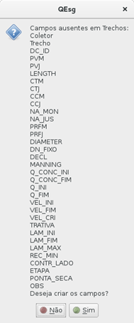
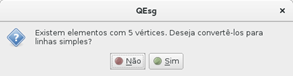

<html>

<body lang=PT-BR>

1&nbsp;&nbsp;&nbsp;&nbsp;&nbsp;&nbsp;&nbsp;&nbsp;&nbsp;&nbsp;&nbsp;&nbsp;&nbsp;&nbsp;&nbsp;&nbsp;&nbsp;&nbsp;&nbsp;&nbsp;
Exemplo de aplicação

&nbsp;

•&nbsp;&nbsp;&nbsp;&nbsp;&nbsp;&nbsp;&nbsp;&nbsp;
Configure o projeto para as coordenadas UTM, conforme a faixa
meridiana local.

•&nbsp;&nbsp;&nbsp;&nbsp;&nbsp;&nbsp;&nbsp;&nbsp;
Carregue um arquivo vetorial (shape) com a rede de esgoto. Como
alternativa você pode criar um arquivo de linhas no formato shape e desenhar a
rede de esgoto utilizando os recursos do QGIS, neste caso siga estritamente as
recomendações seguintes para a criação de arquivo:

&#9702;&nbsp;&nbsp;&nbsp;&nbsp;&nbsp;&nbsp;&nbsp;
Salve o arquivo com o nome <b>Trechos</b> utilizando um Sistema
de Referência de Coordenadas (CRS) em Projeção UTM, para a faixa meridiana
local.

&#9702;&nbsp;&nbsp;&nbsp;&nbsp;&nbsp;&nbsp;&nbsp;
Escolha a codificação de arquivos segundo o padrão ISO 8859-1.

&#9702;&nbsp;&nbsp;&nbsp;&nbsp;&nbsp;&nbsp;&nbsp;
Desenhe sempre os trechos na direção do fluxo (de montante para
jusante).

&#9702;&nbsp;&nbsp;&nbsp;&nbsp;&nbsp;&nbsp;&nbsp;
Não é necessário criar nenhum campo específico no momento de
salvar o shape <b>Trechos</b>.

•&nbsp;&nbsp;&nbsp;&nbsp;&nbsp;&nbsp;&nbsp;&nbsp;
Salve o projeto. Nesse momento a janela do projeto terá a
aparência da <b>Figura 1</b>.

•&nbsp;&nbsp;&nbsp;&nbsp;&nbsp;&nbsp;&nbsp;&nbsp;
Abra a tabela de atributos do shape de rede, onde existirá uma
linha para cada coletor traçado e somente um campo com valores nulos (vide <b>Figura
1</b>).

&nbsp;

Figura 1 - Aparência inicial do
projeto, após carregar ou traçar a rede de esgotos.

&nbsp;

&nbsp;

2&nbsp;&nbsp;&nbsp;&nbsp;&nbsp;&nbsp;&nbsp;&nbsp;&nbsp;&nbsp;&nbsp;&nbsp;&nbsp;&nbsp;&nbsp;&nbsp;&nbsp;&nbsp;&nbsp;&nbsp;
Botão 00 Configuração

&nbsp;

Ao clicar abre uma janela apresentada na <b>Figura 2</b>.

&nbsp;

 

&nbsp;

<table class=MsoNormalTable border=0 cellspacing=0 cellpadding=0 width=605
 style='margin-left:2.25pt;border-collapse:collapse'>
 <tr>
  <td width=302 valign=top style='width:8.0cm;border:solid black 1.0pt;
  border-right:none;padding:2.75pt 2.75pt 2.75pt 2.75pt'>
  
Figura 2 - Janela
  do Botão 00 - Configuração

  </td>
  <td width=302 valign=top style='width:8.0cm;border:solid black 1.0pt;
  padding:2.75pt 2.75pt 2.75pt 2.75pt'>
  
Figura 3 - Janela
  do Botão 00 – Configuração após preenchimento dos dados básicos

  </td>
 </tr>
</table>

&nbsp;

Preencher as informações informações básicas na janela
aberta.

•&nbsp;&nbsp;&nbsp;&nbsp;&nbsp;&nbsp;&nbsp;&nbsp;
No grupo Layers selecione o arquivo de linhas que você salvou com
o nome <b>Trechos</b>, com o traçado da rede.  

•&nbsp;&nbsp;&nbsp;&nbsp;&nbsp;&nbsp;&nbsp;&nbsp;
Neste exemplo, somente incluiremos dois parâmetros de entrada da
aba <b>Dados</b> (atenção: não digite separador de milhar, o ponto é separador
de decimais):

&#9702;&nbsp;&nbsp;&nbsp;&nbsp;&nbsp;&nbsp;&nbsp;
População inicial : (digite) 10000

&#9702;&nbsp;&nbsp;&nbsp;&nbsp;&nbsp;&nbsp;&nbsp;
População de saturação: (digite) 13000

•&nbsp;&nbsp;&nbsp;&nbsp;&nbsp;&nbsp;&nbsp;&nbsp;
Mantenha os parâmetros padrões das abas <b>Tubos</b> e <b>Opções
de cálculo</b>. A janela terá a aparência da <b>Figura 3</b>.

•&nbsp;&nbsp;&nbsp;&nbsp;&nbsp;&nbsp;&nbsp;&nbsp;
Clique no botão <b>OK</b> para salvar os parâmetros gerais do
projeto.

&nbsp;

&nbsp;

3&nbsp;&nbsp;&nbsp;&nbsp;&nbsp;&nbsp;&nbsp;&nbsp;&nbsp;&nbsp;&nbsp;&nbsp;&nbsp;&nbsp;&nbsp;&nbsp;&nbsp;&nbsp;&nbsp;&nbsp;
Botão 01 verifica/cria campos

&nbsp;

Ao pressionar neste botão o plugin verifica se o shape <b>Trechos</b>
com o traçado da rede contém os campos padrões. Se não existe oferece a
possibilidade de criá-los automaticamente, como mostra a <b>Figura 4</b>.
Aceite essa opção.

&nbsp;

Abra novamente a  tabela de atributos do shape <b>Trechos</b>
com a rede de esgoto (vide <b>Figura 5</b>). Você verá que foram criados um
conjunto de campos para cada coletor traçado. Os valores contidos nesses campos
serão nulos o zeros (sem informação ainda).

&nbsp;

<table class=MsoNormalTable border=0 cellspacing=0 cellpadding=0 width=605
 style='margin-left:2.25pt;border-collapse:collapse'>
 <tr>
  <td width=302 valign=top style='width:8.0cm;border:solid black 1.0pt;
  border-right:none;padding:2.75pt 2.75pt 2.75pt 2.75pt'>
  

  
Figura 4 - Mensagem para criação dos campos padrões no
  shape da rede de esgotos.

  </td>
  <td width=302 valign=top style='width:8.0cm;border:solid black 1.0pt;
  padding:2.75pt 2.75pt 2.75pt 2.75pt'>
  

  
Figura 5 - Tabela da rede de esgotos, após a criação
  dos campos padrões.

  </td>
 </tr>
</table>

&nbsp;

&nbsp;

4&nbsp;&nbsp;&nbsp;&nbsp;&nbsp;&nbsp;&nbsp;&nbsp;&nbsp;&nbsp;&nbsp;&nbsp;&nbsp;&nbsp;&nbsp;&nbsp;&nbsp;&nbsp;&nbsp;&nbsp;
BOTÃO 02 NUMERAR REDE

&nbsp;

Ao clicar nesse botão é verificado se o traçado da rede de
esgoto é composto por segmentos simples (segmentos de reta individuais entre
vértices consecutivos). Caso exista algum elemento de rede com mais de dois
vértices, será apresentada uma mensagem semelhante à da <b>Figura 6</b>.

&nbsp;

Figura 6 -
Mensagem subdivisão de coletores em trechos.

&nbsp;

No nosso exemplo, antes de clicar pela primeira vez, o shape <b>Trechos</b>
possui três coletores traçados de montante para jusante (vide <b>Figura 5</b>)
definidos por poligonais abertas (um coletor com 5 vértices e dois coletores
com 3). Na mensagem semelhante à da <b>Figura 6</b> clicar em <b>Sim</b>.

•&nbsp;&nbsp;&nbsp;&nbsp;&nbsp;&nbsp;&nbsp;&nbsp;
<u>Mensagem para subdivisão de coletores em trechos</u>. Existem
elementos com ( …). Deseja convertê-los para linhas simples? (vide ) <b>Figura
6</b>. Clique no botão Sim.

&nbsp;

Figura 7 - Mensagem subdivisão de coletores em trechos.

&nbsp;

Será aberta uma janela, semelhante à <b>Figura 7</b>, a qual
será fixada na lateral direita no ambiente QGIS. Nos passos a seguir, proceda
com atenção.

•&nbsp;&nbsp;&nbsp;&nbsp;&nbsp;&nbsp;&nbsp;&nbsp;
Verifique que a caixa &lt;Coletor&gt; esteja preenchido com o
valor 1. Senão digite o valor 1.

•&nbsp;&nbsp;&nbsp;&nbsp;&nbsp;&nbsp;&nbsp;&nbsp;
Verifique que a caixa &lt;Número de dígitos&gt; esteja preenchido
com o valor 1. Senão digite o valor 1.

•&nbsp;&nbsp;&nbsp;&nbsp;&nbsp;&nbsp;&nbsp;&nbsp;
Verifique que a opção &lt;Somente trechos sem identificação&gt;
esteja selecionada.

•&nbsp;&nbsp;&nbsp;&nbsp;&nbsp;&nbsp;&nbsp;&nbsp;
Clique no botão &lt;Selecionar Montante&gt;.

•&nbsp;&nbsp;&nbsp;&nbsp;&nbsp;&nbsp;&nbsp;&nbsp;
Movimente o cursor e faça clique com o botão direito no meio do
trecho mais a montante do coletor principal da rede. Todos os trechos do
coletor mudará para a cor amarela (padrão de seleção do QGIS)

•&nbsp;&nbsp;&nbsp;&nbsp;&nbsp;&nbsp;&nbsp;&nbsp;
Clique no botão &lt;Renomear&gt; da janela Renomear Coletores. Na
primeira vez, o estilo do shape <b>Trechos</b> é alterado, são representados os
vértices e o sentido do fluxo. Para o coletor renomeado serão apresentadas as
informações: nome do trecho e nomes dos PVs de montante e jusante.

•&nbsp;&nbsp;&nbsp;&nbsp;&nbsp;&nbsp;&nbsp;&nbsp;
Clique no botão &lt;Novo Coletor&gt;. O número da caixa Coletor
mudará para 2 e o trecho anterior será deselecionado.

•&nbsp;&nbsp;&nbsp;&nbsp;&nbsp;&nbsp;&nbsp;&nbsp;
Verifique o a opção &lt;Somente trechos sem identificação&gt;
continue selecionado.

•&nbsp;&nbsp;&nbsp;&nbsp;&nbsp;&nbsp;&nbsp;&nbsp;
Selecione o segundo coletor (no nosso exemplo, o coletor mais a
jusante), cuja cor mudará para amarelo até o PV de interligação com o coletor
anterior.

•&nbsp;&nbsp;&nbsp;&nbsp;&nbsp;&nbsp;&nbsp;&nbsp;
Clique em renomear o coletor selecionado. O coletor selecionado
será renomeado e numerado, de forma análoga ao primeiro coletor.

•&nbsp;&nbsp;&nbsp;&nbsp;&nbsp;&nbsp;&nbsp;&nbsp;
Repita o processo (Novo coletor, clicar sobre o coletor,
renomear) até concluir com a nomeação dos trechos da rede.

•&nbsp;&nbsp;&nbsp;&nbsp;&nbsp;&nbsp;&nbsp;&nbsp;
Salve o shape <b>Trechos</b> com a da rede e encerre o processo
de edição.

&nbsp;

No shape <b>Trechos</b> foram preenchidos os campos Coletor,
Trecho, DC_ID, PVM e PVJ.

&nbsp;

&nbsp;

5&nbsp;&nbsp;&nbsp;&nbsp;&nbsp;&nbsp;&nbsp;&nbsp;&nbsp;&nbsp;&nbsp;&nbsp;&nbsp;&nbsp;&nbsp;&nbsp;&nbsp;&nbsp;&nbsp;&nbsp;
BOTÃO 03 CRIAR LAYER DE NÓS

&nbsp;

•&nbsp;&nbsp;&nbsp;&nbsp;&nbsp;&nbsp;&nbsp;&nbsp;
Ao clicar no botão é aberta a janela para atribuição do nome do
shape de nós (formato de pontos). Selecione o local e nomes adequados a este
layer, para este exemplo escolha como nome <b>Nos</b>. Clique no botão Salvar
para concluir a gravação do layer. <u>Atenção</u>: quando elaborávamos este
tutorial, no ambiente Linux, a biblioteca utilizada para salvar o shape de <b>Nos</b>
apresentava um bug. Era necessário digitar a extensão “.shp” ao final do nome
do arquivo para que ocorra o carregamento automático do arquivo salvo.
Recomendamos que

•&nbsp;&nbsp;&nbsp;&nbsp;&nbsp;&nbsp;&nbsp;&nbsp;
Após fechar a janela o shape <b>Nos</b> é adicionado ao projeto.

•&nbsp;&nbsp;&nbsp;&nbsp;&nbsp;&nbsp;&nbsp;&nbsp;
Habilite o modo de edição do shape <b>Nos</b> e preencha todos os
campos de cota do terreno de cada nó.

•&nbsp;&nbsp;&nbsp;&nbsp;&nbsp;&nbsp;&nbsp;&nbsp;
Salve o shape <b>Nos</b> e desabilite o modo de edição.

•&nbsp;&nbsp;&nbsp;&nbsp;&nbsp;&nbsp;&nbsp;&nbsp;
Salve o projeto.

&nbsp;

&nbsp;

6&nbsp;&nbsp;&nbsp;&nbsp;&nbsp;&nbsp;&nbsp;&nbsp;&nbsp;&nbsp;&nbsp;&nbsp;&nbsp;&nbsp;&nbsp;&nbsp;&nbsp;&nbsp;&nbsp;&nbsp;
BOTÃO 04 PreenchE OS CAMPOS

&nbsp;

Ao clicar no botão:

•&nbsp;&nbsp;&nbsp;&nbsp;&nbsp;&nbsp;&nbsp;&nbsp;
Todos os campos nulos do shape <b>Trechos</b> são preenchidos;

•&nbsp;&nbsp;&nbsp;&nbsp;&nbsp;&nbsp;&nbsp;&nbsp;
São sobrescritos todos os campos de cota dos PVs de montante,
jusante e comprimento do trecho (calculado como comprimento real do trecho
desenhado) do shape <b>Trechos;</b>

•&nbsp;&nbsp;&nbsp;&nbsp;&nbsp;&nbsp;&nbsp;&nbsp;
São transferidos os valores do campo COTA_TN do shape <b>Nos </b>para
os campos CTM e CTJ do shape <b>Trechos</b>.

•&nbsp;&nbsp;&nbsp;&nbsp;&nbsp;&nbsp;&nbsp;&nbsp;
Salve o shape <b>Trechos</b> e saia do modo de edição.

&nbsp;

Para este exemplo desconsidere as mensagens de advertência
referente à falta do layer <b>Intercepção</b>.

&nbsp;

&nbsp;

7&nbsp;&nbsp;&nbsp;&nbsp;&nbsp;&nbsp;&nbsp;&nbsp;&nbsp;&nbsp;&nbsp;&nbsp;&nbsp;&nbsp;&nbsp;&nbsp;&nbsp;&nbsp;&nbsp;&nbsp;
PONTA SECA

&nbsp;

Tem como único objetivo a representação adequada do PVs de
montante de cada coletor. A ponta seca é informada manualmente na tabela do
shape <b>Trechos</b>, campo (coluna) PONTA_SECA, trocando a letra N (não) pela
letra S (sim).

&nbsp;

Salve as modificações introduzidas na tabela do shape <b>Trechos</b>
e saia do modo de edição. Salve o projeto.

&nbsp;

&nbsp;

8&nbsp;&nbsp;&nbsp;&nbsp;&nbsp;&nbsp;&nbsp;&nbsp;&nbsp;&nbsp;&nbsp;&nbsp;&nbsp;&nbsp;&nbsp;&nbsp;&nbsp;&nbsp;&nbsp;&nbsp;
BOTÃO 5 CALCULA VAZÃO

&nbsp;

Ao clicar neste botão, são calculadas as vazões acumuladas ao
longo de cada um dos trechos que formam os coletores, os resultdos são gravados
no shape <b>Trechos</b>. O formato de apresentação dos trechos muda para
mostrar os dados: nome do trecho; PV de montante; PV de jusante e comprimento
de cada trecho.

&nbsp;

&nbsp;

9&nbsp;&nbsp;&nbsp;&nbsp;&nbsp;&nbsp;&nbsp;&nbsp;&nbsp;&nbsp;&nbsp;&nbsp;&nbsp;&nbsp;&nbsp;&nbsp;&nbsp;&nbsp;&nbsp;&nbsp;
BOTÃO 6 DIMENSIONA

&nbsp;

Ao clicar neste botão, são dimensionados todos os trechos que
formam os coletores da rede. O formato de apresentação dos trechos muda para
mostrar os dados: nome do trecho; comprimento; diâmetro nominal e declividade.

&nbsp;

Abra a tabela do shape <b>Trechos</b>, selecione todos os
campos, copie e cole dentro de uma planilha eletrônica (MS-Excel,
Libreoffice-Calc ou outra). Todos os dados do dimensionamento estão contidos na
tabela do shape <b>Trechos</b>.

10&nbsp;&nbsp;&nbsp;&nbsp;&nbsp;&nbsp;&nbsp;&nbsp;&nbsp;&nbsp;&nbsp;&nbsp;&nbsp;&nbsp;&nbsp;&nbsp;
UNIDADES DAS TABELAS

&nbsp;

10.1&nbsp;&nbsp;&nbsp;&nbsp;&nbsp;&nbsp;&nbsp;&nbsp;&nbsp;&nbsp;&nbsp;
SHAPE TRECHOS

<table class=MsoNormalTable border=0 cellspacing=0 cellpadding=0 width=605
 style='margin-left:2.25pt;border-collapse:collapse'>
 <tr>
  <td width=101 valign=top style='width:75.6pt;border:solid black 1.0pt;
  border-right:none;padding:2.75pt 2.75pt 2.75pt 2.75pt'>
  
<b>Ordem</b>

  </td>
  <td width=101 valign=top style='width:75.6pt;border:solid black 1.0pt;
  border-right:none;padding:2.75pt 2.75pt 2.75pt 2.75pt'>
  
<b>Nome</b>

  </td>
  <td width=101 valign=top style='width:75.6pt;border:solid black 1.0pt;
  border-right:none;padding:2.75pt 2.75pt 2.75pt 2.75pt'>
  
<b>Unidade</b>

  </td>
  <td width=101 valign=top style='width:75.6pt;border:solid black 1.0pt;
  border-right:none;padding:2.75pt 2.75pt 2.75pt 2.75pt'>
  
<b>Tipo</b>

  </td>
  <td width=101 valign=top style='width:75.6pt;border:solid black 1.0pt;
  border-right:none;padding:2.75pt 2.75pt 2.75pt 2.75pt'>
  
<b>Comprimento</b>

  </td>
  <td width=101 valign=top style='width:75.6pt;border:solid black 1.0pt;
  padding:2.75pt 2.75pt 2.75pt 2.75pt'>
  
<b>Precisão</b>

  </td>
 </tr>
 <tr>
  <td width=101 valign=top style='width:75.6pt;border-top:none;border-left:
  solid black 1.0pt;border-bottom:solid black 1.0pt;border-right:none;
  padding:2.75pt 2.75pt 2.75pt 2.75pt'>
  
1

  </td>
  <td width=101 valign=top style='width:75.6pt;border-top:none;border-left:
  solid black 1.0pt;border-bottom:solid black 1.0pt;border-right:none;
  padding:2.75pt 2.75pt 2.75pt 2.75pt'>
  
DC_ID

  </td>
  <td width=101 valign=top style='width:75.6pt;border-top:none;border-left:
  solid black 1.0pt;border-bottom:solid black 1.0pt;border-right:none;
  padding:2.75pt 2.75pt 2.75pt 2.75pt'>
  
-

  </td>
  <td width=101 valign=top style='width:75.6pt;border-top:none;border-left:
  solid black 1.0pt;border-bottom:solid black 1.0pt;border-right:none;
  padding:2.75pt 2.75pt 2.75pt 2.75pt'>
  
String

  </td>
  <td width=101 valign=top style='width:75.6pt;border-top:none;border-left:
  solid black 1.0pt;border-bottom:solid black 1.0pt;border-right:none;
  padding:2.75pt 2.75pt 2.75pt 2.75pt'>
  
10

  </td>
  <td width=101 valign=top style='width:75.6pt;border:solid black 1.0pt;
  border-top:none;padding:2.75pt 2.75pt 2.75pt 2.75pt'>
  
-

  </td>
 </tr>
 <tr>
  <td width=101 valign=top style='width:75.6pt;border-top:none;border-left:
  solid black 1.0pt;border-bottom:solid black 1.0pt;border-right:none;
  padding:2.75pt 2.75pt 2.75pt 2.75pt'>
  
2

  </td>
  <td width=101 valign=top style='width:75.6pt;border-top:none;border-left:
  solid black 1.0pt;border-bottom:solid black 1.0pt;border-right:none;
  padding:2.75pt 2.75pt 2.75pt 2.75pt'>
  
COTA_TN

  </td>
  <td width=101 valign=top style='width:75.6pt;border-top:none;border-left:
  solid black 1.0pt;border-bottom:solid black 1.0pt;border-right:none;
  padding:2.75pt 2.75pt 2.75pt 2.75pt'>
  
m

  </td>
  <td width=101 valign=top style='width:75.6pt;border-top:none;border-left:
  solid black 1.0pt;border-bottom:solid black 1.0pt;border-right:none;
  padding:2.75pt 2.75pt 2.75pt 2.75pt'>
  
Real

  </td>
  <td width=101 valign=top style='width:75.6pt;border-top:none;border-left:
  solid black 1.0pt;border-bottom:solid black 1.0pt;border-right:none;
  padding:2.75pt 2.75pt 2.75pt 2.75pt'>
  
10

  </td>
  <td width=101 valign=top style='width:75.6pt;border:solid black 1.0pt;
  border-top:none;padding:2.75pt 2.75pt 2.75pt 2.75pt'>
  
3

  </td>
 </tr>
</table>

&nbsp;

10.2&nbsp;&nbsp;&nbsp;&nbsp;&nbsp;&nbsp;&nbsp;&nbsp;&nbsp;&nbsp;&nbsp;
SHAPE NOS

<table class=MsoNormalTable border=0 cellspacing=0 cellpadding=0 width=605
 style='margin-left:2.25pt;border-collapse:collapse'>
 <tr>
  <td width=101 valign=top style='width:75.6pt;border:solid black 1.0pt;
  border-right:none;padding:2.75pt 2.75pt 2.75pt 2.75pt'>
  
<b>Ordem</b>

  </td>
  <td width=101 valign=top style='width:75.6pt;border:solid black 1.0pt;
  border-right:none;padding:2.75pt 2.75pt 2.75pt 2.75pt'>
  
<b>Nome</b>

  </td>
  <td width=101 valign=top style='width:75.6pt;border:solid black 1.0pt;
  border-right:none;padding:2.75pt 2.75pt 2.75pt 2.75pt'>
  
<b>Unidade</b>

  </td>
  <td width=101 valign=top style='width:75.6pt;border:solid black 1.0pt;
  border-right:none;padding:2.75pt 2.75pt 2.75pt 2.75pt'>
  
<b>Tipo</b>

  </td>
  <td width=101 valign=top style='width:75.6pt;border:solid black 1.0pt;
  border-right:none;padding:2.75pt 2.75pt 2.75pt 2.75pt'>
  
<b>Comprimento</b>

  </td>
  <td width=101 valign=top style='width:75.6pt;border:solid black 1.0pt;
  padding:2.75pt 2.75pt 2.75pt 2.75pt'>
  
<b>Precisão</b>

  </td>
 </tr>
 <tr>
  <td width=101 valign=top style='width:75.6pt;border-top:none;border-left:
  solid black 1.0pt;border-bottom:solid black 1.0pt;border-right:none;
  padding:2.75pt 2.75pt 2.75pt 2.75pt'>
  
1

  </td>
  <td width=101 valign=top style='width:75.6pt;border-top:none;border-left:
  solid black 1.0pt;border-bottom:solid black 1.0pt;border-right:none;
  padding:2.75pt 2.75pt 2.75pt 2.75pt'>
  
DC_ID

  </td>
  <td width=101 valign=top style='width:75.6pt;border-top:none;border-left:
  solid black 1.0pt;border-bottom:solid black 1.0pt;border-right:none;
  padding:2.75pt 2.75pt 2.75pt 2.75pt'>
  
-

  </td>
  <td width=101 valign=top style='width:75.6pt;border-top:none;border-left:
  solid black 1.0pt;border-bottom:solid black 1.0pt;border-right:none;
  padding:2.75pt 2.75pt 2.75pt 2.75pt'>
  
QString

  </td>
  <td width=101 valign=top style='width:75.6pt;border-top:none;border-left:
  solid black 1.0pt;border-bottom:solid black 1.0pt;border-right:none;
  padding:2.75pt 2.75pt 2.75pt 2.75pt'>
  
10

  </td>
  <td width=101 valign=top style='width:75.6pt;border:solid black 1.0pt;
  border-top:none;padding:2.75pt 2.75pt 2.75pt 2.75pt'>
  
-

  </td>
 </tr>
 <tr>
  <td width=101 valign=top style='width:75.6pt;border-top:none;border-left:
  solid black 1.0pt;border-bottom:solid black 1.0pt;border-right:none;
  padding:2.75pt 2.75pt 2.75pt 2.75pt'>
  
2

  </td>
  <td width=101 valign=top style='width:75.6pt;border-top:none;border-left:
  solid black 1.0pt;border-bottom:solid black 1.0pt;border-right:none;
  padding:2.75pt 2.75pt 2.75pt 2.75pt'>
  
PVM

  </td>
  <td width=101 valign=top style='width:75.6pt;border-top:none;border-left:
  solid black 1.0pt;border-bottom:solid black 1.0pt;border-right:none;
  padding:2.75pt 2.75pt 2.75pt 2.75pt'>
  
-

  </td>
  <td width=101 valign=top style='width:75.6pt;border-top:none;border-left:
  solid black 1.0pt;border-bottom:solid black 1.0pt;border-right:none;
  padding:2.75pt 2.75pt 2.75pt 2.75pt'>
  
QString

  </td>
  <td width=101 valign=top style='width:75.6pt;border-top:none;border-left:
  solid black 1.0pt;border-bottom:solid black 1.0pt;border-right:none;
  padding:2.75pt 2.75pt 2.75pt 2.75pt'>
  
10

  </td>
  <td width=101 valign=top style='width:75.6pt;border:solid black 1.0pt;
  border-top:none;padding:2.75pt 2.75pt 2.75pt 2.75pt'>
  
-

  </td>
 </tr>
 <tr>
  <td width=101 valign=top style='width:75.6pt;border-top:none;border-left:
  solid black 1.0pt;border-bottom:solid black 1.0pt;border-right:none;
  padding:2.75pt 2.75pt 2.75pt 2.75pt'>
  
3

  </td>
  <td width=101 valign=top style='width:75.6pt;border-top:none;border-left:
  solid black 1.0pt;border-bottom:solid black 1.0pt;border-right:none;
  padding:2.75pt 2.75pt 2.75pt 2.75pt'>
  
PVJ

  </td>
  <td width=101 valign=top style='width:75.6pt;border-top:none;border-left:
  solid black 1.0pt;border-bottom:solid black 1.0pt;border-right:none;
  padding:2.75pt 2.75pt 2.75pt 2.75pt'>
  
-

  </td>
  <td width=101 valign=top style='width:75.6pt;border-top:none;border-left:
  solid black 1.0pt;border-bottom:solid black 1.0pt;border-right:none;
  padding:2.75pt 2.75pt 2.75pt 2.75pt'>
  
QString

  </td>
  <td width=101 valign=top style='width:75.6pt;border-top:none;border-left:
  solid black 1.0pt;border-bottom:solid black 1.0pt;border-right:none;
  padding:2.75pt 2.75pt 2.75pt 2.75pt'>
  
10

  </td>
  <td width=101 valign=top style='width:75.6pt;border:solid black 1.0pt;
  border-top:none;padding:2.75pt 2.75pt 2.75pt 2.75pt'>
  
-

  </td>
 </tr>
 <tr>
  <td width=101 valign=top style='width:75.6pt;border-top:none;border-left:
  solid black 1.0pt;border-bottom:solid black 1.0pt;border-right:none;
  padding:2.75pt 2.75pt 2.75pt 2.75pt'>
  
4

  </td>
  <td width=101 valign=top style='width:75.6pt;border-top:none;border-left:
  solid black 1.0pt;border-bottom:solid black 1.0pt;border-right:none;
  padding:2.75pt 2.75pt 2.75pt 2.75pt'>
  
LENGTH

  </td>
  <td width=101 valign=top style='width:75.6pt;border-top:none;border-left:
  solid black 1.0pt;border-bottom:solid black 1.0pt;border-right:none;
  padding:2.75pt 2.75pt 2.75pt 2.75pt'>
  
m

  </td>
  <td width=101 valign=top style='width:75.6pt;border-top:none;border-left:
  solid black 1.0pt;border-bottom:solid black 1.0pt;border-right:none;
  padding:2.75pt 2.75pt 2.75pt 2.75pt'>
  
Real

  </td>
  <td width=101 valign=top style='width:75.6pt;border-top:none;border-left:
  solid black 1.0pt;border-bottom:solid black 1.0pt;border-right:none;
  padding:2.75pt 2.75pt 2.75pt 2.75pt'>
  
10

  </td>
  <td width=101 valign=top style='width:75.6pt;border:solid black 1.0pt;
  border-top:none;padding:2.75pt 2.75pt 2.75pt 2.75pt'>
  
1

  </td>
 </tr>
 <tr>
  <td width=101 valign=top style='width:75.6pt;border-top:none;border-left:
  solid black 1.0pt;border-bottom:solid black 1.0pt;border-right:none;
  padding:2.75pt 2.75pt 2.75pt 2.75pt'>
  
5

  </td>
  <td width=101 valign=top style='width:75.6pt;border-top:none;border-left:
  solid black 1.0pt;border-bottom:solid black 1.0pt;border-right:none;
  padding:2.75pt 2.75pt 2.75pt 2.75pt'>
  
CTM

  </td>
  <td width=101 valign=top style='width:75.6pt;border-top:none;border-left:
  solid black 1.0pt;border-bottom:solid black 1.0pt;border-right:none;
  padding:2.75pt 2.75pt 2.75pt 2.75pt'>
  
m

  </td>
  <td width=101 valign=top style='width:75.6pt;border-top:none;border-left:
  solid black 1.0pt;border-bottom:solid black 1.0pt;border-right:none;
  padding:2.75pt 2.75pt 2.75pt 2.75pt'>
  
Real

  </td>
  <td width=101 valign=top style='width:75.6pt;border-top:none;border-left:
  solid black 1.0pt;border-bottom:solid black 1.0pt;border-right:none;
  padding:2.75pt 2.75pt 2.75pt 2.75pt'>
  
10

  </td>
  <td width=101 valign=top style='width:75.6pt;border:solid black 1.0pt;
  border-top:none;padding:2.75pt 2.75pt 2.75pt 2.75pt'>
  
3

  </td>
 </tr>
 <tr>
  <td width=101 valign=top style='width:75.6pt;border-top:none;border-left:
  solid black 1.0pt;border-bottom:solid black 1.0pt;border-right:none;
  padding:2.75pt 2.75pt 2.75pt 2.75pt'>
  
6

  </td>
  <td width=101 valign=top style='width:75.6pt;border-top:none;border-left:
  solid black 1.0pt;border-bottom:solid black 1.0pt;border-right:none;
  padding:2.75pt 2.75pt 2.75pt 2.75pt'>
  
CTJ

  </td>
  <td width=101 valign=top style='width:75.6pt;border-top:none;border-left:
  solid black 1.0pt;border-bottom:solid black 1.0pt;border-right:none;
  padding:2.75pt 2.75pt 2.75pt 2.75pt'>
  
m

  </td>
  <td width=101 valign=top style='width:75.6pt;border-top:none;border-left:
  solid black 1.0pt;border-bottom:solid black 1.0pt;border-right:none;
  padding:2.75pt 2.75pt 2.75pt 2.75pt'>
  
Real

  </td>
  <td width=101 valign=top style='width:75.6pt;border-top:none;border-left:
  solid black 1.0pt;border-bottom:solid black 1.0pt;border-right:none;
  padding:2.75pt 2.75pt 2.75pt 2.75pt'>
  
10

  </td>
  <td width=101 valign=top style='width:75.6pt;border:solid black 1.0pt;
  border-top:none;padding:2.75pt 2.75pt 2.75pt 2.75pt'>
  
3

  </td>
 </tr>
 <tr>
  <td width=101 valign=top style='width:75.6pt;border-top:none;border-left:
  solid black 1.0pt;border-bottom:solid black 1.0pt;border-right:none;
  padding:2.75pt 2.75pt 2.75pt 2.75pt'>
  
7

  </td>
  <td width=101 valign=top style='width:75.6pt;border-top:none;border-left:
  solid black 1.0pt;border-bottom:solid black 1.0pt;border-right:none;
  padding:2.75pt 2.75pt 2.75pt 2.75pt'>
  
CCM

  </td>
  <td width=101 valign=top style='width:75.6pt;border-top:none;border-left:
  solid black 1.0pt;border-bottom:solid black 1.0pt;border-right:none;
  padding:2.75pt 2.75pt 2.75pt 2.75pt'>
  
m

  </td>
  <td width=101 valign=top style='width:75.6pt;border-top:none;border-left:
  solid black 1.0pt;border-bottom:solid black 1.0pt;border-right:none;
  padding:2.75pt 2.75pt 2.75pt 2.75pt'>
  
Real

  </td>
  <td width=101 valign=top style='width:75.6pt;border-top:none;border-left:
  solid black 1.0pt;border-bottom:solid black 1.0pt;border-right:none;
  padding:2.75pt 2.75pt 2.75pt 2.75pt'>
  
10

  </td>
  <td width=101 valign=top style='width:75.6pt;border:solid black 1.0pt;
  border-top:none;padding:2.75pt 2.75pt 2.75pt 2.75pt'>
  
3

  </td>
 </tr>
 <tr>
  <td width=101 valign=top style='width:75.6pt;border-top:none;border-left:
  solid black 1.0pt;border-bottom:solid black 1.0pt;border-right:none;
  padding:2.75pt 2.75pt 2.75pt 2.75pt'>
  
8

  </td>
  <td width=101 valign=top style='width:75.6pt;border-top:none;border-left:
  solid black 1.0pt;border-bottom:solid black 1.0pt;border-right:none;
  padding:2.75pt 2.75pt 2.75pt 2.75pt'>
  
CCJ

  </td>
  <td width=101 valign=top style='width:75.6pt;border-top:none;border-left:
  solid black 1.0pt;border-bottom:solid black 1.0pt;border-right:none;
  padding:2.75pt 2.75pt 2.75pt 2.75pt'>
  
m

  </td>
  <td width=101 valign=top style='width:75.6pt;border-top:none;border-left:
  solid black 1.0pt;border-bottom:solid black 1.0pt;border-right:none;
  padding:2.75pt 2.75pt 2.75pt 2.75pt'>
  
Real

  </td>
  <td width=101 valign=top style='width:75.6pt;border-top:none;border-left:
  solid black 1.0pt;border-bottom:solid black 1.0pt;border-right:none;
  padding:2.75pt 2.75pt 2.75pt 2.75pt'>
  
10

  </td>
  <td width=101 valign=top style='width:75.6pt;border:solid black 1.0pt;
  border-top:none;padding:2.75pt 2.75pt 2.75pt 2.75pt'>
  
3

  </td>
 </tr>
 <tr>
  <td width=101 valign=top style='width:75.6pt;border-top:none;border-left:
  solid black 1.0pt;border-bottom:solid black 1.0pt;border-right:none;
  padding:2.75pt 2.75pt 2.75pt 2.75pt'>
  
9

  </td>
  <td width=101 valign=top style='width:75.6pt;border-top:none;border-left:
  solid black 1.0pt;border-bottom:solid black 1.0pt;border-right:none;
  padding:2.75pt 2.75pt 2.75pt 2.75pt'>
  
NA_MON

  </td>
  <td width=101 valign=top style='width:75.6pt;border-top:none;border-left:
  solid black 1.0pt;border-bottom:solid black 1.0pt;border-right:none;
  padding:2.75pt 2.75pt 2.75pt 2.75pt'>
  
m

  </td>
  <td width=101 valign=top style='width:75.6pt;border-top:none;border-left:
  solid black 1.0pt;border-bottom:solid black 1.0pt;border-right:none;
  padding:2.75pt 2.75pt 2.75pt 2.75pt'>
  
Real

  </td>
  <td width=101 valign=top style='width:75.6pt;border-top:none;border-left:
  solid black 1.0pt;border-bottom:solid black 1.0pt;border-right:none;
  padding:2.75pt 2.75pt 2.75pt 2.75pt'>
  
10

  </td>
  <td width=101 valign=top style='width:75.6pt;border:solid black 1.0pt;
  border-top:none;padding:2.75pt 2.75pt 2.75pt 2.75pt'>
  
3

  </td>
 </tr>
 <tr>
  <td width=101 valign=top style='width:75.6pt;border-top:none;border-left:
  solid black 1.0pt;border-bottom:solid black 1.0pt;border-right:none;
  padding:2.75pt 2.75pt 2.75pt 2.75pt'>
  
10

  </td>
  <td width=101 valign=top style='width:75.6pt;border-top:none;border-left:
  solid black 1.0pt;border-bottom:solid black 1.0pt;border-right:none;
  padding:2.75pt 2.75pt 2.75pt 2.75pt'>
  
NA_JUS

  </td>
  <td width=101 valign=top style='width:75.6pt;border-top:none;border-left:
  solid black 1.0pt;border-bottom:solid black 1.0pt;border-right:none;
  padding:2.75pt 2.75pt 2.75pt 2.75pt'>
  
m

  </td>
  <td width=101 valign=top style='width:75.6pt;border-top:none;border-left:
  solid black 1.0pt;border-bottom:solid black 1.0pt;border-right:none;
  padding:2.75pt 2.75pt 2.75pt 2.75pt'>
  
Real

  </td>
  <td width=101 valign=top style='width:75.6pt;border-top:none;border-left:
  solid black 1.0pt;border-bottom:solid black 1.0pt;border-right:none;
  padding:2.75pt 2.75pt 2.75pt 2.75pt'>
  
10

  </td>
  <td width=101 valign=top style='width:75.6pt;border:solid black 1.0pt;
  border-top:none;padding:2.75pt 2.75pt 2.75pt 2.75pt'>
  
3

  </td>
 </tr>
 <tr>
  <td width=101 valign=top style='width:75.6pt;border-top:none;border-left:
  solid black 1.0pt;border-bottom:solid black 1.0pt;border-right:none;
  padding:2.75pt 2.75pt 2.75pt 2.75pt'>
  
11

  </td>
  <td width=101 valign=top style='width:75.6pt;border-top:none;border-left:
  solid black 1.0pt;border-bottom:solid black 1.0pt;border-right:none;
  padding:2.75pt 2.75pt 2.75pt 2.75pt'>
  
PRFM

  </td>
  <td width=101 valign=top style='width:75.6pt;border-top:none;border-left:
  solid black 1.0pt;border-bottom:solid black 1.0pt;border-right:none;
  padding:2.75pt 2.75pt 2.75pt 2.75pt'>
  
m

  </td>
  <td width=101 valign=top style='width:75.6pt;border-top:none;border-left:
  solid black 1.0pt;border-bottom:solid black 1.0pt;border-right:none;
  padding:2.75pt 2.75pt 2.75pt 2.75pt'>
  
Real

  </td>
  <td width=101 valign=top style='width:75.6pt;border-top:none;border-left:
  solid black 1.0pt;border-bottom:solid black 1.0pt;border-right:none;
  padding:2.75pt 2.75pt 2.75pt 2.75pt'>
  
10

  </td>
  <td width=101 valign=top style='width:75.6pt;border:solid black 1.0pt;
  border-top:none;padding:2.75pt 2.75pt 2.75pt 2.75pt'>
  
3

  </td>
 </tr>
 <tr>
  <td width=101 valign=top style='width:75.6pt;border-top:none;border-left:
  solid black 1.0pt;border-bottom:solid black 1.0pt;border-right:none;
  padding:2.75pt 2.75pt 2.75pt 2.75pt'>
  
12

  </td>
  <td width=101 valign=top style='width:75.6pt;border-top:none;border-left:
  solid black 1.0pt;border-bottom:solid black 1.0pt;border-right:none;
  padding:2.75pt 2.75pt 2.75pt 2.75pt'>
  
PRFJ

  </td>
  <td width=101 valign=top style='width:75.6pt;border-top:none;border-left:
  solid black 1.0pt;border-bottom:solid black 1.0pt;border-right:none;
  padding:2.75pt 2.75pt 2.75pt 2.75pt'>
  
m

  </td>
  <td width=101 valign=top style='width:75.6pt;border-top:none;border-left:
  solid black 1.0pt;border-bottom:solid black 1.0pt;border-right:none;
  padding:2.75pt 2.75pt 2.75pt 2.75pt'>
  
Real

  </td>
  <td width=101 valign=top style='width:75.6pt;border-top:none;border-left:
  solid black 1.0pt;border-bottom:solid black 1.0pt;border-right:none;
  padding:2.75pt 2.75pt 2.75pt 2.75pt'>
  
10

  </td>
  <td width=101 valign=top style='width:75.6pt;border:solid black 1.0pt;
  border-top:none;padding:2.75pt 2.75pt 2.75pt 2.75pt'>
  
3

  </td>
 </tr>
 <tr>
  <td width=101 valign=top style='width:75.6pt;border-top:none;border-left:
  solid black 1.0pt;border-bottom:solid black 1.0pt;border-right:none;
  padding:2.75pt 2.75pt 2.75pt 2.75pt'>
  
13

  </td>
  <td width=101 valign=top style='width:75.6pt;border-top:none;border-left:
  solid black 1.0pt;border-bottom:solid black 1.0pt;border-right:none;
  padding:2.75pt 2.75pt 2.75pt 2.75pt'>
  
DIAMETER

  </td>
  <td width=101 valign=top style='width:75.6pt;border-top:none;border-left:
  solid black 1.0pt;border-bottom:solid black 1.0pt;border-right:none;
  padding:2.75pt 2.75pt 2.75pt 2.75pt'>
  
mm

  </td>
  <td width=101 valign=top style='width:75.6pt;border-top:none;border-left:
  solid black 1.0pt;border-bottom:solid black 1.0pt;border-right:none;
  padding:2.75pt 2.75pt 2.75pt 2.75pt'>
  
Real

  </td>
  <td width=101 valign=top style='width:75.6pt;border-top:none;border-left:
  solid black 1.0pt;border-bottom:solid black 1.0pt;border-right:none;
  padding:2.75pt 2.75pt 2.75pt 2.75pt'>
  
10

  </td>
  <td width=101 valign=top style='width:75.6pt;border:solid black 1.0pt;
  border-top:none;padding:2.75pt 2.75pt 2.75pt 2.75pt'>
  
1

  </td>
 </tr>
 <tr>
  <td width=101 valign=top style='width:75.6pt;border-top:none;border-left:
  solid black 1.0pt;border-bottom:solid black 1.0pt;border-right:none;
  padding:2.75pt 2.75pt 2.75pt 2.75pt'>
  
14

  </td>
  <td width=101 valign=top style='width:75.6pt;border-top:none;border-left:
  solid black 1.0pt;border-bottom:solid black 1.0pt;border-right:none;
  padding:2.75pt 2.75pt 2.75pt 2.75pt'>
  
DN_FIXO

  </td>
  <td width=101 valign=top style='width:75.6pt;border-top:none;border-left:
  solid black 1.0pt;border-bottom:solid black 1.0pt;border-right:none;
  padding:2.75pt 2.75pt 2.75pt 2.75pt'>
  
-

  </td>
  <td width=101 valign=top style='width:75.6pt;border-top:none;border-left:
  solid black 1.0pt;border-bottom:solid black 1.0pt;border-right:none;
  padding:2.75pt 2.75pt 2.75pt 2.75pt'>
  
String

  </td>
  <td width=101 valign=top style='width:75.6pt;border-top:none;border-left:
  solid black 1.0pt;border-bottom:solid black 1.0pt;border-right:none;
  padding:2.75pt 2.75pt 2.75pt 2.75pt'>
  
10

  </td>
  <td width=101 valign=top style='width:75.6pt;border:solid black 1.0pt;
  border-top:none;padding:2.75pt 2.75pt 2.75pt 2.75pt'>
  
-

  </td>
 </tr>
 <tr>
  <td width=101 valign=top style='width:75.6pt;border-top:none;border-left:
  solid black 1.0pt;border-bottom:solid black 1.0pt;border-right:none;
  padding:2.75pt 2.75pt 2.75pt 2.75pt'>
  
15

  </td>
  <td width=101 valign=top style='width:75.6pt;border-top:none;border-left:
  solid black 1.0pt;border-bottom:solid black 1.0pt;border-right:none;
  padding:2.75pt 2.75pt 2.75pt 2.75pt'>
  
DECL

  </td>
  <td width=101 valign=top style='width:75.6pt;border-top:none;border-left:
  solid black 1.0pt;border-bottom:solid black 1.0pt;border-right:none;
  padding:2.75pt 2.75pt 2.75pt 2.75pt'>
  
m

  </td>
  <td width=101 valign=top style='width:75.6pt;border-top:none;border-left:
  solid black 1.0pt;border-bottom:solid black 1.0pt;border-right:none;
  padding:2.75pt 2.75pt 2.75pt 2.75pt'>
  
Real

  </td>
  <td width=101 valign=top style='width:75.6pt;border-top:none;border-left:
  solid black 1.0pt;border-bottom:solid black 1.0pt;border-right:none;
  padding:2.75pt 2.75pt 2.75pt 2.75pt'>
  
10

  </td>
  <td width=101 valign=top style='width:75.6pt;border:solid black 1.0pt;
  border-top:none;padding:2.75pt 2.75pt 2.75pt 2.75pt'>
  
5

  </td>
 </tr>
 <tr>
  <td width=101 valign=top style='width:75.6pt;border-top:none;border-left:
  solid black 1.0pt;border-bottom:solid black 1.0pt;border-right:none;
  padding:2.75pt 2.75pt 2.75pt 2.75pt'>
  
16

  </td>
  <td width=101 valign=top style='width:75.6pt;border-top:none;border-left:
  solid black 1.0pt;border-bottom:solid black 1.0pt;border-right:none;
  padding:2.75pt 2.75pt 2.75pt 2.75pt'>
  
MANNING

  </td>
  <td width=101 valign=top style='width:75.6pt;border-top:none;border-left:
  solid black 1.0pt;border-bottom:solid black 1.0pt;border-right:none;
  padding:2.75pt 2.75pt 2.75pt 2.75pt'>
  
m

  </td>
  <td width=101 valign=top style='width:75.6pt;border-top:none;border-left:
  solid black 1.0pt;border-bottom:solid black 1.0pt;border-right:none;
  padding:2.75pt 2.75pt 2.75pt 2.75pt'>
  
Real

  </td>
  <td width=101 valign=top style='width:75.6pt;border-top:none;border-left:
  solid black 1.0pt;border-bottom:solid black 1.0pt;border-right:none;
  padding:2.75pt 2.75pt 2.75pt 2.75pt'>
  
10

  </td>
  <td width=101 valign=top style='width:75.6pt;border:solid black 1.0pt;
  border-top:none;padding:2.75pt 2.75pt 2.75pt 2.75pt'>
  
3

  </td>
 </tr>
 <tr>
  <td width=101 valign=top style='width:75.6pt;border-top:none;border-left:
  solid black 1.0pt;border-bottom:solid black 1.0pt;border-right:none;
  padding:2.75pt 2.75pt 2.75pt 2.75pt'>
  
17

  </td>
  <td width=101 valign=top style='width:75.6pt;border-top:none;border-left:
  solid black 1.0pt;border-bottom:solid black 1.0pt;border-right:none;
  padding:2.75pt 2.75pt 2.75pt 2.75pt'>
  
Q_CONC_INI

  </td>
  <td width=101 valign=top style='width:75.6pt;border-top:none;border-left:
  solid black 1.0pt;border-bottom:solid black 1.0pt;border-right:none;
  padding:2.75pt 2.75pt 2.75pt 2.75pt'>
  
m

  </td>
  <td width=101 valign=top style='width:75.6pt;border-top:none;border-left:
  solid black 1.0pt;border-bottom:solid black 1.0pt;border-right:none;
  padding:2.75pt 2.75pt 2.75pt 2.75pt'>
  
Real

  </td>
  <td width=101 valign=top style='width:75.6pt;border-top:none;border-left:
  solid black 1.0pt;border-bottom:solid black 1.0pt;border-right:none;
  padding:2.75pt 2.75pt 2.75pt 2.75pt'>
  
10

  </td>
  <td width=101 valign=top style='width:75.6pt;border:solid black 1.0pt;
  border-top:none;padding:2.75pt 2.75pt 2.75pt 2.75pt'>
  
3

  </td>
 </tr>
 <tr>
  <td width=101 valign=top style='width:75.6pt;border-top:none;border-left:
  solid black 1.0pt;border-bottom:solid black 1.0pt;border-right:none;
  padding:2.75pt 2.75pt 2.75pt 2.75pt'>
  
18

  </td>
  <td width=101 valign=top style='width:75.6pt;border-top:none;border-left:
  solid black 1.0pt;border-bottom:solid black 1.0pt;border-right:none;
  padding:2.75pt 2.75pt 2.75pt 2.75pt'>
  
Q_CONC_FIM

  </td>
  <td width=101 valign=top style='width:75.6pt;border-top:none;border-left:
  solid black 1.0pt;border-bottom:solid black 1.0pt;border-right:none;
  padding:2.75pt 2.75pt 2.75pt 2.75pt'>
  
m

  </td>
  <td width=101 valign=top style='width:75.6pt;border-top:none;border-left:
  solid black 1.0pt;border-bottom:solid black 1.0pt;border-right:none;
  padding:2.75pt 2.75pt 2.75pt 2.75pt'>
  
Real

  </td>
  <td width=101 valign=top style='width:75.6pt;border-top:none;border-left:
  solid black 1.0pt;border-bottom:solid black 1.0pt;border-right:none;
  padding:2.75pt 2.75pt 2.75pt 2.75pt'>
  
10

  </td>
  <td width=101 valign=top style='width:75.6pt;border:solid black 1.0pt;
  border-top:none;padding:2.75pt 2.75pt 2.75pt 2.75pt'>
  
3

  </td>
 </tr>
 <tr>
  <td width=101 valign=top style='width:75.6pt;border-top:none;border-left:
  solid black 1.0pt;border-bottom:solid black 1.0pt;border-right:none;
  padding:2.75pt 2.75pt 2.75pt 2.75pt'>
  
19

  </td>
  <td width=101 valign=top style='width:75.6pt;border-top:none;border-left:
  solid black 1.0pt;border-bottom:solid black 1.0pt;border-right:none;
  padding:2.75pt 2.75pt 2.75pt 2.75pt'>
  
Q_INI

  </td>
  <td width=101 valign=top style='width:75.6pt;border-top:none;border-left:
  solid black 1.0pt;border-bottom:solid black 1.0pt;border-right:none;
  padding:2.75pt 2.75pt 2.75pt 2.75pt'>
  
m

  </td>
  <td width=101 valign=top style='width:75.6pt;border-top:none;border-left:
  solid black 1.0pt;border-bottom:solid black 1.0pt;border-right:none;
  padding:2.75pt 2.75pt 2.75pt 2.75pt'>
  
Real

  </td>
  <td width=101 valign=top style='width:75.6pt;border-top:none;border-left:
  solid black 1.0pt;border-bottom:solid black 1.0pt;border-right:none;
  padding:2.75pt 2.75pt 2.75pt 2.75pt'>
  
10

  </td>
  <td width=101 valign=top style='width:75.6pt;border:solid black 1.0pt;
  border-top:none;padding:2.75pt 2.75pt 2.75pt 2.75pt'>
  
3

  </td>
 </tr>
 <tr>
  <td width=101 valign=top style='width:75.6pt;border-top:none;border-left:
  solid black 1.0pt;border-bottom:solid black 1.0pt;border-right:none;
  padding:2.75pt 2.75pt 2.75pt 2.75pt'>
  
20

  </td>
  <td width=101 valign=top style='width:75.6pt;border-top:none;border-left:
  solid black 1.0pt;border-bottom:solid black 1.0pt;border-right:none;
  padding:2.75pt 2.75pt 2.75pt 2.75pt'>
  
Q_FIM

  </td>
  <td width=101 valign=top style='width:75.6pt;border-top:none;border-left:
  solid black 1.0pt;border-bottom:solid black 1.0pt;border-right:none;
  padding:2.75pt 2.75pt 2.75pt 2.75pt'>
  
m

  </td>
  <td width=101 valign=top style='width:75.6pt;border-top:none;border-left:
  solid black 1.0pt;border-bottom:solid black 1.0pt;border-right:none;
  padding:2.75pt 2.75pt 2.75pt 2.75pt'>
  
Real

  </td>
  <td width=101 valign=top style='width:75.6pt;border-top:none;border-left:
  solid black 1.0pt;border-bottom:solid black 1.0pt;border-right:none;
  padding:2.75pt 2.75pt 2.75pt 2.75pt'>
  
10

  </td>
  <td width=101 valign=top style='width:75.6pt;border:solid black 1.0pt;
  border-top:none;padding:2.75pt 2.75pt 2.75pt 2.75pt'>
  
3

  </td>
 </tr>
 <tr>
  <td width=101 valign=top style='width:75.6pt;border-top:none;border-left:
  solid black 1.0pt;border-bottom:solid black 1.0pt;border-right:none;
  padding:2.75pt 2.75pt 2.75pt 2.75pt'>
  
21

  </td>
  <td width=101 valign=top style='width:75.6pt;border-top:none;border-left:
  solid black 1.0pt;border-bottom:solid black 1.0pt;border-right:none;
  padding:2.75pt 2.75pt 2.75pt 2.75pt'>
  
VEL_INI

  </td>
  <td width=101 valign=top style='width:75.6pt;border-top:none;border-left:
  solid black 1.0pt;border-bottom:solid black 1.0pt;border-right:none;
  padding:2.75pt 2.75pt 2.75pt 2.75pt'>
  
m

  </td>
  <td width=101 valign=top style='width:75.6pt;border-top:none;border-left:
  solid black 1.0pt;border-bottom:solid black 1.0pt;border-right:none;
  padding:2.75pt 2.75pt 2.75pt 2.75pt'>
  
Real

  </td>
  <td width=101 valign=top style='width:75.6pt;border-top:none;border-left:
  solid black 1.0pt;border-bottom:solid black 1.0pt;border-right:none;
  padding:2.75pt 2.75pt 2.75pt 2.75pt'>
  
10

  </td>
  <td width=101 valign=top style='width:75.6pt;border:solid black 1.0pt;
  border-top:none;padding:2.75pt 2.75pt 2.75pt 2.75pt'>
  
2

  </td>
 </tr>
 <tr>
  <td width=101 valign=top style='width:75.6pt;border-top:none;border-left:
  solid black 1.0pt;border-bottom:solid black 1.0pt;border-right:none;
  padding:2.75pt 2.75pt 2.75pt 2.75pt'>
  
22

  </td>
  <td width=101 valign=top style='width:75.6pt;border-top:none;border-left:
  solid black 1.0pt;border-bottom:solid black 1.0pt;border-right:none;
  padding:2.75pt 2.75pt 2.75pt 2.75pt'>
  
VEL_FIM

  </td>
  <td width=101 valign=top style='width:75.6pt;border-top:none;border-left:
  solid black 1.0pt;border-bottom:solid black 1.0pt;border-right:none;
  padding:2.75pt 2.75pt 2.75pt 2.75pt'>
  
m

  </td>
  <td width=101 valign=top style='width:75.6pt;border-top:none;border-left:
  solid black 1.0pt;border-bottom:solid black 1.0pt;border-right:none;
  padding:2.75pt 2.75pt 2.75pt 2.75pt'>
  
Real

  </td>
  <td width=101 valign=top style='width:75.6pt;border-top:none;border-left:
  solid black 1.0pt;border-bottom:solid black 1.0pt;border-right:none;
  padding:2.75pt 2.75pt 2.75pt 2.75pt'>
  
10

  </td>
  <td width=101 valign=top style='width:75.6pt;border:solid black 1.0pt;
  border-top:none;padding:2.75pt 2.75pt 2.75pt 2.75pt'>
  
2

  </td>
 </tr>
 <tr>
  <td width=101 valign=top style='width:75.6pt;border-top:none;border-left:
  solid black 1.0pt;border-bottom:solid black 1.0pt;border-right:none;
  padding:2.75pt 2.75pt 2.75pt 2.75pt'>
  
23

  </td>
  <td width=101 valign=top style='width:75.6pt;border-top:none;border-left:
  solid black 1.0pt;border-bottom:solid black 1.0pt;border-right:none;
  padding:2.75pt 2.75pt 2.75pt 2.75pt'>
  
VEL_CRI

  </td>
  <td width=101 valign=top style='width:75.6pt;border-top:none;border-left:
  solid black 1.0pt;border-bottom:solid black 1.0pt;border-right:none;
  padding:2.75pt 2.75pt 2.75pt 2.75pt'>
  
m

  </td>
  <td width=101 valign=top style='width:75.6pt;border-top:none;border-left:
  solid black 1.0pt;border-bottom:solid black 1.0pt;border-right:none;
  padding:2.75pt 2.75pt 2.75pt 2.75pt'>
  
Real

  </td>
  <td width=101 valign=top style='width:75.6pt;border-top:none;border-left:
  solid black 1.0pt;border-bottom:solid black 1.0pt;border-right:none;
  padding:2.75pt 2.75pt 2.75pt 2.75pt'>
  
10

  </td>
  <td width=101 valign=top style='width:75.6pt;border:solid black 1.0pt;
  border-top:none;padding:2.75pt 2.75pt 2.75pt 2.75pt'>
  
2

  </td>
 </tr>
 <tr>
  <td width=101 valign=top style='width:75.6pt;border-top:none;border-left:
  solid black 1.0pt;border-bottom:solid black 1.0pt;border-right:none;
  padding:2.75pt 2.75pt 2.75pt 2.75pt'>
  
24

  </td>
  <td width=101 valign=top style='width:75.6pt;border-top:none;border-left:
  solid black 1.0pt;border-bottom:solid black 1.0pt;border-right:none;
  padding:2.75pt 2.75pt 2.75pt 2.75pt'>
  
TRATIVA

  </td>
  <td width=101 valign=top style='width:75.6pt;border-top:none;border-left:
  solid black 1.0pt;border-bottom:solid black 1.0pt;border-right:none;
  padding:2.75pt 2.75pt 2.75pt 2.75pt'>
  
m

  </td>
  <td width=101 valign=top style='width:75.6pt;border-top:none;border-left:
  solid black 1.0pt;border-bottom:solid black 1.0pt;border-right:none;
  padding:2.75pt 2.75pt 2.75pt 2.75pt'>
  
Real

  </td>
  <td width=101 valign=top style='width:75.6pt;border-top:none;border-left:
  solid black 1.0pt;border-bottom:solid black 1.0pt;border-right:none;
  padding:2.75pt 2.75pt 2.75pt 2.75pt'>
  
10

  </td>
  <td width=101 valign=top style='width:75.6pt;border:solid black 1.0pt;
  border-top:none;padding:2.75pt 2.75pt 2.75pt 2.75pt'>
  
3

  </td>
 </tr>
 <tr>
  <td width=101 valign=top style='width:75.6pt;border-top:none;border-left:
  solid black 1.0pt;border-bottom:solid black 1.0pt;border-right:none;
  padding:2.75pt 2.75pt 2.75pt 2.75pt'>
  
25

  </td>
  <td width=101 valign=top style='width:75.6pt;border-top:none;border-left:
  solid black 1.0pt;border-bottom:solid black 1.0pt;border-right:none;
  padding:2.75pt 2.75pt 2.75pt 2.75pt'>
  
LAM_INI

  </td>
  <td width=101 valign=top style='width:75.6pt;border-top:none;border-left:
  solid black 1.0pt;border-bottom:solid black 1.0pt;border-right:none;
  padding:2.75pt 2.75pt 2.75pt 2.75pt'>
  
m

  </td>
  <td width=101 valign=top style='width:75.6pt;border-top:none;border-left:
  solid black 1.0pt;border-bottom:solid black 1.0pt;border-right:none;
  padding:2.75pt 2.75pt 2.75pt 2.75pt'>
  
Real

  </td>
  <td width=101 valign=top style='width:75.6pt;border-top:none;border-left:
  solid black 1.0pt;border-bottom:solid black 1.0pt;border-right:none;
  padding:2.75pt 2.75pt 2.75pt 2.75pt'>
  
10

  </td>
  <td width=101 valign=top style='width:75.6pt;border:solid black 1.0pt;
  border-top:none;padding:2.75pt 2.75pt 2.75pt 2.75pt'>
  
4

  </td>
 </tr>
 <tr>
  <td width=101 valign=top style='width:75.6pt;border-top:none;border-left:
  solid black 1.0pt;border-bottom:solid black 1.0pt;border-right:none;
  padding:2.75pt 2.75pt 2.75pt 2.75pt'>
  
26

  </td>
  <td width=101 valign=top style='width:75.6pt;border-top:none;border-left:
  solid black 1.0pt;border-bottom:solid black 1.0pt;border-right:none;
  padding:2.75pt 2.75pt 2.75pt 2.75pt'>
  
LAM_FIM

  </td>
  <td width=101 valign=top style='width:75.6pt;border-top:none;border-left:
  solid black 1.0pt;border-bottom:solid black 1.0pt;border-right:none;
  padding:2.75pt 2.75pt 2.75pt 2.75pt'>
  
m

  </td>
  <td width=101 valign=top style='width:75.6pt;border-top:none;border-left:
  solid black 1.0pt;border-bottom:solid black 1.0pt;border-right:none;
  padding:2.75pt 2.75pt 2.75pt 2.75pt'>
  
Real

  </td>
  <td width=101 valign=top style='width:75.6pt;border-top:none;border-left:
  solid black 1.0pt;border-bottom:solid black 1.0pt;border-right:none;
  padding:2.75pt 2.75pt 2.75pt 2.75pt'>
  
10

  </td>
  <td width=101 valign=top style='width:75.6pt;border:solid black 1.0pt;
  border-top:none;padding:2.75pt 2.75pt 2.75pt 2.75pt'>
  
2

  </td>
 </tr>
 <tr>
  <td width=101 valign=top style='width:75.6pt;border-top:none;border-left:
  solid black 1.0pt;border-bottom:solid black 1.0pt;border-right:none;
  padding:2.75pt 2.75pt 2.75pt 2.75pt'>
  
27

  </td>
  <td width=101 valign=top style='width:75.6pt;border-top:none;border-left:
  solid black 1.0pt;border-bottom:solid black 1.0pt;border-right:none;
  padding:2.75pt 2.75pt 2.75pt 2.75pt'>
  
LAM_MAX

  </td>
  <td width=101 valign=top style='width:75.6pt;border-top:none;border-left:
  solid black 1.0pt;border-bottom:solid black 1.0pt;border-right:none;
  padding:2.75pt 2.75pt 2.75pt 2.75pt'>
  
m

  </td>
  <td width=101 valign=top style='width:75.6pt;border-top:none;border-left:
  solid black 1.0pt;border-bottom:solid black 1.0pt;border-right:none;
  padding:2.75pt 2.75pt 2.75pt 2.75pt'>
  
Real

  </td>
  <td width=101 valign=top style='width:75.6pt;border-top:none;border-left:
  solid black 1.0pt;border-bottom:solid black 1.0pt;border-right:none;
  padding:2.75pt 2.75pt 2.75pt 2.75pt'>
  
10

  </td>
  <td width=101 valign=top style='width:75.6pt;border:solid black 1.0pt;
  border-top:none;padding:2.75pt 2.75pt 2.75pt 2.75pt'>
  
2

  </td>
 </tr>
 <tr>
  <td width=101 valign=top style='width:75.6pt;border-top:none;border-left:
  solid black 1.0pt;border-bottom:solid black 1.0pt;border-right:none;
  padding:2.75pt 2.75pt 2.75pt 2.75pt'>
  
28

  </td>
  <td width=101 valign=top style='width:75.6pt;border-top:none;border-left:
  solid black 1.0pt;border-bottom:solid black 1.0pt;border-right:none;
  padding:2.75pt 2.75pt 2.75pt 2.75pt'>
  
REC_MIN

  </td>
  <td width=101 valign=top style='width:75.6pt;border-top:none;border-left:
  solid black 1.0pt;border-bottom:solid black 1.0pt;border-right:none;
  padding:2.75pt 2.75pt 2.75pt 2.75pt'>
  
m

  </td>
  <td width=101 valign=top style='width:75.6pt;border-top:none;border-left:
  solid black 1.0pt;border-bottom:solid black 1.0pt;border-right:none;
  padding:2.75pt 2.75pt 2.75pt 2.75pt'>
  
Real

  </td>
  <td width=101 valign=top style='width:75.6pt;border-top:none;border-left:
  solid black 1.0pt;border-bottom:solid black 1.0pt;border-right:none;
  padding:2.75pt 2.75pt 2.75pt 2.75pt'>
  
10

  </td>
  <td width=101 valign=top style='width:75.6pt;border:solid black 1.0pt;
  border-top:none;padding:2.75pt 2.75pt 2.75pt 2.75pt'>
  
2

  </td>
 </tr>
 <tr>
  <td width=101 valign=top style='width:75.6pt;border-top:none;border-left:
  solid black 1.0pt;border-bottom:solid black 1.0pt;border-right:none;
  padding:2.75pt 2.75pt 2.75pt 2.75pt'>
  
29

  </td>
  <td width=101 valign=top style='width:75.6pt;border-top:none;border-left:
  solid black 1.0pt;border-bottom:solid black 1.0pt;border-right:none;
  padding:2.75pt 2.75pt 2.75pt 2.75pt'>
  
CONTR_LADO

  </td>
  <td width=101 valign=top style='width:75.6pt;border-top:none;border-left:
  solid black 1.0pt;border-bottom:solid black 1.0pt;border-right:none;
  padding:2.75pt 2.75pt 2.75pt 2.75pt'>
  
-

  </td>
  <td width=101 valign=top style='width:75.6pt;border-top:none;border-left:
  solid black 1.0pt;border-bottom:solid black 1.0pt;border-right:none;
  padding:2.75pt 2.75pt 2.75pt 2.75pt'>
  
Integer

  </td>
  <td width=101 valign=top style='width:75.6pt;border-top:none;border-left:
  solid black 1.0pt;border-bottom:solid black 1.0pt;border-right:none;
  padding:2.75pt 2.75pt 2.75pt 2.75pt'>
  
1

  </td>
  <td width=101 valign=top style='width:75.6pt;border:solid black 1.0pt;
  border-top:none;padding:2.75pt 2.75pt 2.75pt 2.75pt'>
  
-

  </td>
 </tr>
 <tr>
  <td width=101 valign=top style='width:75.6pt;border-top:none;border-left:
  solid black 1.0pt;border-bottom:solid black 1.0pt;border-right:none;
  padding:2.75pt 2.75pt 2.75pt 2.75pt'>
  
30

  </td>
  <td width=101 valign=top style='width:75.6pt;border-top:none;border-left:
  solid black 1.0pt;border-bottom:solid black 1.0pt;border-right:none;
  padding:2.75pt 2.75pt 2.75pt 2.75pt'>
  
ETAPA

  </td>
  <td width=101 valign=top style='width:75.6pt;border-top:none;border-left:
  solid black 1.0pt;border-bottom:solid black 1.0pt;border-right:none;
  padding:2.75pt 2.75pt 2.75pt 2.75pt'>
  
-

  </td>
  <td width=101 valign=top style='width:75.6pt;border-top:none;border-left:
  solid black 1.0pt;border-bottom:solid black 1.0pt;border-right:none;
  padding:2.75pt 2.75pt 2.75pt 2.75pt'>
  
Integer

  </td>
  <td width=101 valign=top style='width:75.6pt;border-top:none;border-left:
  solid black 1.0pt;border-bottom:solid black 1.0pt;border-right:none;
  padding:2.75pt 2.75pt 2.75pt 2.75pt'>
  
1

  </td>
  <td width=101 valign=top style='width:75.6pt;border:solid black 1.0pt;
  border-top:none;padding:2.75pt 2.75pt 2.75pt 2.75pt'>
  
-

  </td>
 </tr>
 <tr>
  <td width=101 valign=top style='width:75.6pt;border-top:none;border-left:
  solid black 1.0pt;border-bottom:solid black 1.0pt;border-right:none;
  padding:2.75pt 2.75pt 2.75pt 2.75pt'>
  
31

  </td>
  <td width=101 valign=top style='width:75.6pt;border-top:none;border-left:
  solid black 1.0pt;border-bottom:solid black 1.0pt;border-right:none;
  padding:2.75pt 2.75pt 2.75pt 2.75pt'>
  
PONTA_SECA

  </td>
  <td width=101 valign=top style='width:75.6pt;border-top:none;border-left:
  solid black 1.0pt;border-bottom:solid black 1.0pt;border-right:none;
  padding:2.75pt 2.75pt 2.75pt 2.75pt'>
  
-

  </td>
  <td width=101 valign=top style='width:75.6pt;border-top:none;border-left:
  solid black 1.0pt;border-bottom:solid black 1.0pt;border-right:none;
  padding:2.75pt 2.75pt 2.75pt 2.75pt'>
  
QString

  </td>
  <td width=101 valign=top style='width:75.6pt;border-top:none;border-left:
  solid black 1.0pt;border-bottom:solid black 1.0pt;border-right:none;
  padding:2.75pt 2.75pt 2.75pt 2.75pt'>
  
1

  </td>
  <td width=101 valign=top style='width:75.6pt;border:solid black 1.0pt;
  border-top:none;padding:2.75pt 2.75pt 2.75pt 2.75pt'>
  
-

  </td>
 </tr>
 <tr>
  <td width=101 valign=top style='width:75.6pt;border-top:none;border-left:
  solid black 1.0pt;border-bottom:solid black 1.0pt;border-right:none;
  padding:2.75pt 2.75pt 2.75pt 2.75pt'>
  
32

  </td>
  <td width=101 valign=top style='width:75.6pt;border-top:none;border-left:
  solid black 1.0pt;border-bottom:solid black 1.0pt;border-right:none;
  padding:2.75pt 2.75pt 2.75pt 2.75pt'>
  
OBS

  </td>
  <td width=101 valign=top style='width:75.6pt;border-top:none;border-left:
  solid black 1.0pt;border-bottom:solid black 1.0pt;border-right:none;
  padding:2.75pt 2.75pt 2.75pt 2.75pt'>
  
-

  </td>
  <td width=101 valign=top style='width:75.6pt;border-top:none;border-left:
  solid black 1.0pt;border-bottom:solid black 1.0pt;border-right:none;
  padding:2.75pt 2.75pt 2.75pt 2.75pt'>
  
QString

  </td>
  <td width=101 valign=top style='width:75.6pt;border-top:none;border-left:
  solid black 1.0pt;border-bottom:solid black 1.0pt;border-right:none;
  padding:2.75pt 2.75pt 2.75pt 2.75pt'>
  
30

  </td>
  <td width=101 valign=top style='width:75.6pt;border:solid black 1.0pt;
  border-top:none;padding:2.75pt 2.75pt 2.75pt 2.75pt'>
  
-

  </td>
 </tr>
</table>

 

10.3&nbsp;&nbsp;&nbsp;&nbsp;&nbsp;&nbsp;&nbsp;&nbsp;&nbsp;&nbsp;&nbsp;
SHAPE INTERFERÊNCIAS

&nbsp;

&nbsp;

&nbsp;

11&nbsp;&nbsp;&nbsp;&nbsp;&nbsp;&nbsp;&nbsp;&nbsp;&nbsp;&nbsp;&nbsp;&nbsp;&nbsp;&nbsp;&nbsp;&nbsp;
providências

&nbsp;

•&nbsp;&nbsp;&nbsp;
Fazer modelo de planilha em Excel (cabeçalhos com unidades) para
exportação de tabela dbf.

•&nbsp;&nbsp;&nbsp;
&nbsp;

</body>

</html>
